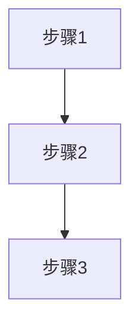

[← 返回主线文档](INDEX.md)

# 设计输出

**时间**：YYYY-MM-DD HH:MM

## 设计概要
- 

## 根据流程级别调整输出

### 快速流程
- 用文字描述设计思路即可，不需要架构图

### 标准流程
- 必须有架构图（Mermaid 格式）
- 必须有实施流程图
- 所有图表须有文字说明

### 完整流程
- 必须有完整架构图（Mermaid 格式）
- 必须有数据流图和控制流图（如适用）
- 必须有实施流程图
- 所有图表须有文字说明

## Mermaid 图（改动前/改动后）

### 改动前（流程/架构）

### 改动后（流程/架构）

## 关键差异说明
- 改动前：
- 改动后：
- 主要差异：

## 实施流程图（可选）

