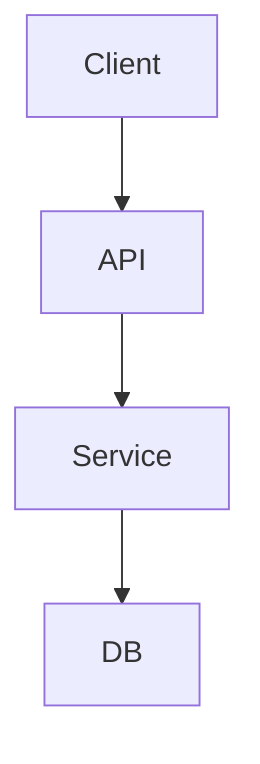
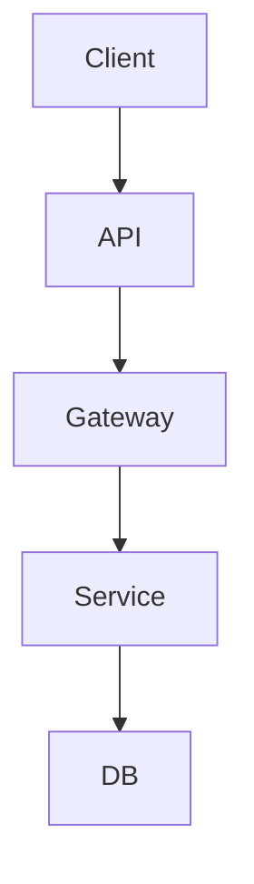

# Mermaid 图模板（简化判断）

> 原则：3-7 节点，仅保留判断所需关键路径。

## 流程图（改动前/改动后）

### 改动前

```mermaid
flowchart LR
  A[入口] --> B[关键步骤]
  B --> C[输出]
```

### 改动后

```mermaid
flowchart LR
  A[入口] --> B[关键步骤]
  B --> D[新增步骤]
  D --> C[输出]
```

## 架构图（改动前/改动后）

### 改动前

```mermaid
graph TD
  Client --> API
  API --> Service
  Service --> DB
```

### 改动后

```mermaid
graph TD
  Client --> API
  API --> Gateway
  Gateway --> Service
  Service --> DB
```

## 差异说明（简短文字）
- 改动前：
- 改动后：
- 主要差异：
