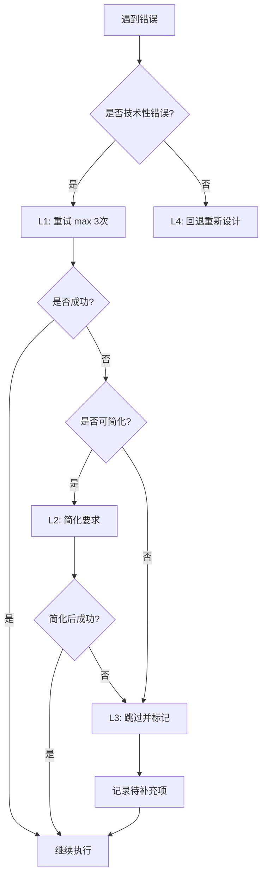

# Complex Task Solver - 复杂问题解决器

> **完全自包含** - 不依赖任何外部开发流程 skills，所有能力都集成在这个 skill 中

## 概述

Complex Task Solver 是一个智能任务编排 skill，核心能力包括：

- **自动评估任务复杂度**（5 因子评分模型）
- **智能路由到快速/标准/完整流程**
- **任务分解和执行单元管理**
- **进度追踪和跨 Chat 断点续传**
- **动态子任务创建和 tracking**
- **错误恢复机制**（4 层策略）

## 触发场景

### ✅ 适用场景

- 用户提出复杂需求或多步骤任务
- 需要判断使用快速流程还是完整流程
- 任务需要拆分为可执行单元
- 需要跨 Chat 追踪实现进度
- 实施过程中可能发现新问题需要 tracking

### ❌ 不适用场景

- 单文件简单修改（如 typo 修复）
- 用户已明确指定具体步骤的任务
- 纯研究性探索任务（使用 Explore agent）

## 核心能力

### 1. 智能复杂度评估

基于 **5 因子评分模型**自动评估任务复杂度：

| 因子 | 说明 | 分数范围 |
|------|------|----------|
| **fileCount** | 涉及的文件数量 | 0-5 分 |
| **crossModule** | 跨模块影响程度 | 0-5 分 |
| **archChange** | 架构变更程度 | 0-5 分 |
| **ambiguity** | 需求清晰度 | 0-5 分 |
| **risk** | 技术风险等级 | 0-5 分 |

**综合评分范围**：0-10 分（总分除以因子数量）

- **< 3.0 分**：简单任务 → Route A（快速流程）
- **3.0-6.0 分**：中等任务 → Route B（标准流程）
- **≥ 6.0 分**：复杂任务 → Route C（完整流程）

### 2. 三层流程路由

#### Route A (快速流程)

**适用**：简单需求，明确实现路径

**流程**：
```
需求理解 → 简化实现计划 → 执行 → 验证
```

**时间**：< 30 分钟

**特点**：
- 无需复杂的设计讨论
- 直接编码实现
- 快速验证和交付

---

#### Route B (标准流程)

**适用**：中等需求，需要设计和分析

**流程**：
```
需求对齐 → 技术方案讨论 → 设计输出 → 影响面分析（简化版）→ 实现计划 → 执行 → 进度追踪
```

**时间**：1-2 小时

**特点**：
- 包含架构图设计
- 简化的影响面分析（重点关注代码和功能）
- 5-10 个实现步骤
- 实时进度追踪

---

#### Route C (完整流程)

**适用**：复杂需求，涉及架构变更或高风险

**流程**：
```
需求对齐 → Brainstorm 阶段 → 完整技术讨论 → 设计输出 → 完整影响面分析 → 任务分解 → 实现计划 → 并行执行 → 进度追踪 → 错误恢复
```

**时间**：> 2 小时或跨多个 Chat

**特点**：
- **Brainstorm 阶段**：生成 2-3 个候选方案并评估
- 完整的 6W2H + 风险 + 影响讨论
- 包含架构图 + 数据流图 + 实施流程图
- 任务拆分为 10+ 可执行单元
- 支持并行执行独立任务
- 动态子任务管理（发现新问题时创建子任务）

### 3. 任务分解与追踪

#### 实现计划文档结构 (`implementation-plan.md`)

```markdown
# 实现计划：[任务名称]

## 总体概览
- **目标**：[总体目标]
- **策略**：[实现策略]
- **预计时间**：[时间估算]

## 总体进度
- **已完成**：X 个步骤
- **进行中**：Y 个步骤
- **待开始**：Z 个步骤
- **总体进度**：XX%

## 详细步骤

### 步骤 1: [步骤名称]
- **状态**：✅ 已完成 / 🚧 进行中 / ⏳ 待开始
- **优先级**：P0 / P1 / P2
- **依赖**：依赖步骤 X
- **任务清单**：
  - [x] 子任务 1
  - [ ] 子任务 2
- **验收标准**：[...]
- **完成时间**：YYYY-MM-DD HH:mm

### 步骤 2: [步骤名称]
...

## 动态子任务
- **子任务 A**（发现于步骤 3）：[描述]
- **子任务 B**（发现于步骤 5）：[描述]
```

**跨 Chat 断点续传**：

当检测到现有 `implementation-plan.md` 文件时：

1. **显示当前进度**：已完成/进行中/待开始步骤数
2. **询问用户**：要继续的步骤或重新开始
3. **恢复上下文**：读取实现计划并继续执行
4. **支持任意步骤继续**：用户可选择从任意未完成步骤继续

### 4. Brainstorm 方案评估（Route C 专属）

**流程**：
1. 分析需求和约束
2. 生成 2-3 个候选方案
3. 从三个维度评估每个方案：
   - 优点/缺点
   - 技术风险
   - 实施成本（时间、复杂度）
4. 提供 AI 推荐方案和理由
5. 等待用户选择

**输出格式**：

```markdown
## 分析需求
你想实现 [X]，使得 [Y]，约束是 [Z]。

## 方案评估

### 方案 1: [思路]
- **优点**：[+]
- **缺点**：[-]
- **风险**：[技术风险评估]
- **成本**：[实施时间和复杂度]

### 方案 2: [思路]
- **优点**：[+]
- **缺点**：[-]
- **风险**：[技术风险评估]
- **成本**：[实施时间和复杂度]

### 方案 3: [思路]
- **优点**：[+]
- **缺点**：[-]
- **风险**：[技术风险评估]
- **成本**：[实施时间和复杂度]

## AI 推荐
基于 [评估标准]，建议选择**方案 X**，理由：[...]
```

### 5. 错误恢复机制

#### 4 层恢复策略

| 层级 | 策略 | 触发条件 | 示例 |
|------|------|----------|------|
| **L1: 重试** | 自动重试（最多 3 次） | 技术性错误 | Mermaid 语法错误 |
| **L2: 简化** | 降低要求 | 重试失败后 | 用文字代替架构图 |
| **L3: 跳过** | 标记待补充 | 简化后仍失败 | 跳过设计阶段 |
| **L4: 回退** | 回退到问题阶段 | 发现根本问题 | 重新需求对齐 |

**恢复决策流程**：



## 使用场景示例

### 场景 1：简单需求 (Route A)

**用户输入**：
```
修复登录页面按钮颜色不一致的问题
```

**AI 执行**：

1. **评分**：
   - fileCount=1 → 0 分
   - crossModule=0 → 0 分
   - archChange=0 → 0 分
   - ambiguity=1 → 1 分
   - risk=0 → 0 分
   - **综合评分**：0.2 分

2. **路由**：Route A (快速流程)

3. **执行**：
   - 定位文件：`src/pages/Login.tsx`
   - 修改样式：统一按钮颜色为 `#0066cc`
   - 验证：运行 dev server 检查效果
   - 提交：创建 commit

---

### 场景 2：中等需求 (Route B)

**用户输入**：
```
新增用户权限管理功能，支持角色配置和权限分配
```

**AI 执行**：

1. **评分**：
   - fileCount=8 → 3 分
   - crossModule=2 → 3 分
   - archChange=1 → 1 分
   - ambiguity=2 → 2 分
   - risk=2 → 2 分
   - **综合评分**：2.2 分

2. **路由**：Route B (标准流程)

3. **执行**：
   - **需求对齐**：确认角色类型、权限粒度、UI 交互
   - **技术方案**：设计数据库表结构、API 接口、前端组件
   - **设计输出**：绘制架构图（Mermaid）
   - **影响分析**：列出涉及的 8 个文件，评估性能影响
   - **实现计划**：拆分为 7 个步骤
   - **执行**：按步骤实现并追踪进度

---

### 场景 3：复杂需求 (Route C)

**用户输入**：
```
重构整个数据层，从 REST API 迁移到 GraphQL
```

**AI 执行**：

1. **评分**：
   - fileCount=40 → 5 分
   - crossModule=5 → 5 分
   - archChange=5 → 5 分
   - ambiguity=3 → 3 分
   - risk=4 → 4 分
   - **综合评分**：4.4 分

2. **路由**：Route C (完整流程)

3. **执行**：
   - **需求对齐**：确认迁移范围、兼容性要求、时间限制

   - **Brainstorm 阶段**：
     - **方案 1**：渐进式迁移（先保留 REST，逐步添加 GraphQL）
     - **方案 2**：并行双写（两套系统同时运行）
     - **方案 3**：一次性切换（高风险但快速）
     - **AI 推荐**：方案 1（渐进式迁移），风险最低

   - **用户选择**：方案 1

   - **完整技术讨论**：GraphQL Schema 设计、Resolver 实现、缓存策略

   - **设计输出**：架构图 + 数据流图 + 迁移流程图

   - **影响面分析**：40+ 文件变更，性能影响评估，回滚方案

   - **任务分解**：拆分为 12 个子任务
     - 设置 Apollo Server
     - 迁移用户模块
     - 迁移订单模块
     - 等等...

   - **实现计划**：定义每个子任务的依赖关系和优先级

   - **并行执行**：独立模块可并行开发

   - **进度追踪**：每完成一个子任务更新 `implementation-plan.md`

   - **动态子任务**：发现新问题（如：需要添加 DataLoader 优化 N+1 查询）时创建子任务

## 详细流程说明

详细的流程步骤、检查清单和模板请查阅 `knowledge/` 子目录：

- [**知识索引**](knowledge/index.md) - 快速导航
- [**1. 复杂度评分详解**](knowledge/1-complexity-scoring.md) - 5 因子评分系统完整说明
- [**2. 路由决策逻辑**](knowledge/2-route-decision.md) - 路由决策逻辑和强制规则
- [**3. Route A 快速流程**](knowledge/3-route-a-fast-flow.md) - Route A 完整流程
- [**4. Route B 标准流程**](knowledge/4-route-b-standard-flow.md) - Route B 完整流程
- [**5. Route C 完整流程**](knowledge/5-route-c-complete-flow.md) - Route C 完整流程
- [**6. 需求对齐流程**](knowledge/6-requirements-alignment.md) - 需求对齐详细流程
- [**7. 完整性检查清单**](knowledge/7-completeness-checklist.md) - 24 项完整性检查清单
- [**8. Brainstorm 协议**](knowledge/8-brainstorm-protocol.md) - Brainstorm 完整流程
- [**9. 任务分解策略**](knowledge/9-task-breakdown.md) - 任务分解策略和算法
- [**10. 设计模板库**](knowledge/10-design-templates.md) - Mermaid 模板库
- [**11. 影响面分析**](knowledge/11-impact-analysis.md) - 影响面分析模板
- [**12. 实现计划文档**](knowledge/12-implementation-plan.md) - 实现计划文档结构
- [**13. 进度追踪机制**](knowledge/13-progress-tracking.md) - 进度追踪和跨 Chat 支持
- [**14. 错误恢复协议**](knowledge/14-error-recovery.md) - 错误恢复协议

## 与其他 Skills 的关系

### 完全独立运作

- ❌ **不依赖** `development-workflow` 或任何开发流程 skills
- ✅ **所有流程、检查清单、模板都自包含**在 `knowledge/` 子目录中
- ✅ **与 `skills-manager` 保持标准的治理关系**（所有 skills 都有）
- ✅ **可选调用 `miravia-git`**（Git 分支规范）但不强制依赖

### 设计理念

这是一个**完全自包含的 skill**，用户无需安装或学习其他开发流程 skills，**开箱即用**。

## 最佳实践

1. **评分透明化**：向用户展示评分结果和理由，增加可理解性
2. **用户确认**：每个关键阶段都等待用户确认，避免错误方向
3. **进度可视化**：实时更新进度百分比，让用户了解整体进展
4. **动态调整**：发现评分不准确时，允许用户手动调整流程级别
5. **证据留存**：所有重大决策和方案选择都记录在文档中

## 限制与注意事项

- 评分模型基于经验规则，可能存在误判，需要人工校准
- Route C 的完整流程耗时较长，适合长周期任务
- 跨 Chat 断点续传依赖于 `implementation-plan.md` 文件的完整性
- 并行执行需要任务之间无强依赖，否则需要串行处理

## 版本历史

- **v1.0.0** (2026-03-09)：初始版本
  - 5 因子复杂度评分模型
  - 三层流程路由（Route A/B/C）
  - Brainstorm 方案评估
  - 任务分解与进度追踪
  - 错误恢复机制（4 层策略）
  - 14 个完整的知识文档
