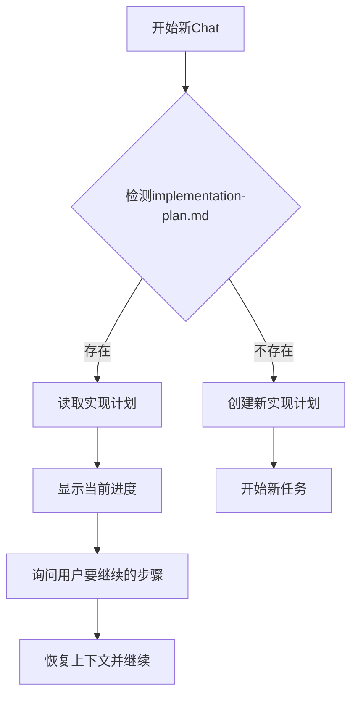
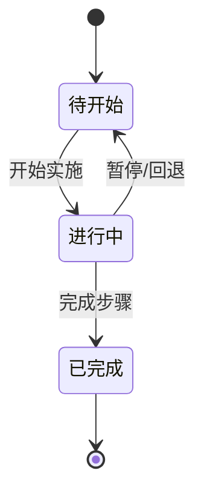

# 13. 进度追踪机制

## 概述

进度追踪机制用于实时追踪任务实施进度，支持跨 Chat 断点续传。

## 核心机制

### 1. 实时更新

每完成一个步骤，立即更新 `implementation-plan.md` 文件。

**更新内容**：
- 步骤状态：⏳ → 🚧 → ✅
- 任务清单：[ ] → [x]
- 完成时间：记录时间戳
- 总体进度：重新计算百分比

---

### 2. 跨 Chat 断点续传

当用户在新的 Chat 中继续任务时，AI 自动检测 `implementation-plan.md` 文件并恢复上下文。

### 检测流程



---

### 恢复流程示例

**AI 检测到现有实现计划**：

```markdown
## 检测到现有实现计划

我发现你有一个正在进行的任务：**用户权限管理功能**

### 当前进度
- **已完成**：3 个步骤（43%）
- **进行中**：1 个步骤
- **待开始**：3 个步骤

### 详细进度
- ✅ 步骤 1: 创建数据库表结构（已完成）
- ✅ 步骤 2: 实现后端 Model（已完成）
- 🚧 步骤 3: 实现后端 Service（进行中）
  - [x] 实现 RoleService
  - [ ] 实现权限校验逻辑
- ⏳ 步骤 4: 实现后端 Controller 和 API（待开始）
- ⏳ 步骤 5: 实现前端组件（待开始）
- ⏳ 步骤 6: 集成前端页面（待开始）
- ⏳ 步骤 7: 测试和优化（待开始）

---

你想从哪里继续？
1. 继续步骤 3（实现权限校验逻辑）
2. 从特定步骤开始
3. 重新审视整个实现计划
```

---

### 用户选择处理

**选项 1：继续进行中的步骤**
- 读取步骤 3 的详细信息
- 识别未完成的子任务
- 继续实施

**选项 2：从特定步骤开始**
- 询问用户选择哪个步骤
- 检查依赖关系
- 如果依赖未满足，提醒用户

**选项 3：重新审视实现计划**
- 显示完整实现计划
- 询问是否需要调整
- 更新计划后继续

---

## 状态同步

### 状态定义

| 状态 | 图标 | 说明 |
|------|------|------|
| 待开始 | ⏳ | 步骤尚未开始 |
| 进行中 | 🚧 | 步骤正在实施 |
| 已完成 | ✅ | 步骤已完成 |

---

### 状态转换



---

## 进度可视化

### 总体进度

```markdown
## 总体进度
- **已完成**：3 个步骤
- **进行中**：1 个步骤
- **待开始**：3 个步骤
- **总体进度**：43% (3/7)

进度条：[████████░░░░░░░░░░] 43%
```

---

### 步骤进度

```markdown
### 步骤 3: 实现后端 Service 🚧 进行中
- **任务清单**：
  - [x] 实现 RoleService
  - [ ] 实现权限校验逻辑

**进度**：50% (1/2)
```

---

## 动态子任务追踪

### 创建动态子任务

实施过程中发现新问题时，创建动态子任务：

```markdown
## 动态子任务

### 子任务 A（发现于步骤 3）
- **描述**：发现需要添加角色缓存机制
- **优先级**：P1
- **状态**：⏳ 待开始
- **依赖**：步骤 3 完成后
- **创建时间**：2026-03-09 11:00
```

---

### 追踪动态子任务

动态子任务也纳入进度追踪：

```markdown
## 总体进度（包含动态子任务）
- **已完成**：3 个步骤 + 0 个动态子任务
- **进行中**：1 个步骤 + 0 个动态子任务
- **待开始**：3 个步骤 + 2 个动态子任务
- **总体进度**：33% (3/9)
```

---

## 最佳实践

### 1. 及时更新

每完成一个步骤或子任务，立即更新 `implementation-plan.md`。

---

### 2. 详细记录

记录完成时间，方便后续回顾和优化。

---

### 3. 进度可视化

保持总体进度百分比准确，让用户了解整体进展。

---

### 4. 跨 Chat 友好

确保 `implementation-plan.md` 文件包含足够的上下文，方便恢复。

---

### 5. 动态调整

发现新问题时及时创建动态子任务，保持计划完整性。

---

## 常见问题

### Q1: 如何判断是否需要跨 Chat 恢复？

**A**: 检查是否存在 `implementation-plan.md` 文件：
- 存在 → 显示进度，询问是否继续
- 不存在 → 创建新实现计划

---

### Q2: 用户想从中间步骤开始怎么办？

**A**: 检查依赖关系：
- 依赖已满足 → 允许从该步骤开始
- 依赖未满足 → 提醒用户需要先完成依赖步骤

---

### Q3: 进度计算是否包含动态子任务？

**A**: 根据情况决定：
- 默认：不包含动态子任务（基于原计划计算）
- 可选：包含动态子任务（更准确反映实际进度）

---

## 参考资料

- [12. 实现计划文档](12-implementation-plan.md) - 实现计划文档结构
- [4. Route B 标准流程](4-route-b-standard-flow.md) - Route B 的进度追踪
- [5. Route C 完整流程](5-route-c-complete-flow.md) - Route C 的进度追踪
