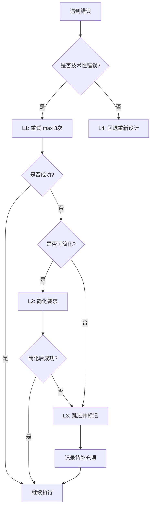

# 14. 错误恢复协议

## 概述

错误恢复协议定义了实施过程中遇到错误时的处理机制，使用 4 层恢复策略。

## 4 层恢复策略



---

## L1: 重试机制

### 适用场景

技术性错误，如：
- Mermaid 语法错误
- API 调用失败（网络问题）
- 文件读写失败（临时问题）

### 重试规则

- **最多重试次数**：3 次
- **重试间隔**：无需等待，立即重试
- **重试方式**：修正错误后重试

### 示例

**错误**：Mermaid 语法错误

```markdown
## ⚠️ 错误提示

绘制架构图时遇到 Mermaid 语法错误。

**错误内容**：[具体错误]

**处理方式**：重试（第 1 次）

---

[修正后的 Mermaid 图]
```

---

## L2: 简化机制

### 适用场景

重试 3 次后仍失败，可以降低要求。

### 简化策略

| 原要求 | 简化为 |
|--------|--------|
| Mermaid 架构图 | 文字描述架构 |
| 完整影响分析 | 简化影响分析 |
| 10+ 任务分解 | 5-7 任务分解 |

### 简化流程

1. **识别可简化项**
2. **向用户说明简化理由**
3. **等待用户确认**
4. **执行简化方案**

### 示例

```markdown
## ⚠️ 简化建议

尝试绘制 Mermaid 架构图失败（已重试 3 次）。

**建议**：使用文字描述架构，而非图表。

**简化方案**：

### 架构描述（文字版）

系统采用三层架构：
1. **前端层**：React + Ant Design
2. **API 层**：Express + GraphQL
3. **数据层**：PostgreSQL + Redis

前端通过 GraphQL 查询后端数据，后端从数据库查询并通过 Redis 缓存优化性能。

---

是否接受简化方案？
```

---

## L3: 跳过机制

### 适用场景

简化后仍失败，或用户不接受简化方案。

### 跳过流程

1. **标记待补充项**
2. **记录在实现计划中**
3. **继续下一阶段**
4. **后续回来处理**

### 示例

```markdown
## ⚠️ 跳过设计输出

绘制架构图失败（已重试 3 次），且简化方案不适用。

**决定**：暂时跳过设计输出阶段，继续后续实施。

**待补充项**：
- [ ] 补充架构设计图

**记录位置**：`implementation-plan.md` - 动态子任务

---

继续下一阶段：影响面分析
```

---

## L4: 回退机制

### 适用场景

发现根本性问题，需要回退重新设计。

### 回退场景

- 技术方案不可行
- 发现重大遗漏
- 架构设计错误

### 回退流程

1. **识别问题根源**
2. **向用户说明问题**
3. **建议回退到哪个阶段**
4. **等待用户确认**
5. **回退并重新执行**

### 示例

```markdown
## ⚠️ 建议回退

在实施步骤 5 时，发现技术方案存在重大问题：

**问题**：GraphQL Schema 设计无法支持复杂的权限校验逻辑。

**影响**：如果继续实施，会导致功能无法实现。

**建议**：回退到"技术方案讨论"阶段，重新设计 Schema。

**回退流程**：
1. 保留已完成的步骤 1-4 的成果
2. 回退到"技术方案讨论"阶段
3. 重新设计 GraphQL Schema
4. 重新制定实现计划
5. 继续实施

---

是否同意回退？
```

---

## 错误分类

### 技术性错误（可重试）

- Mermaid 语法错误
- API 调用失败（网络问题）
- 文件读写失败（临时问题）
- 工具调用失败（临时问题）

### 方案性错误（需回退）

- 技术方案不可行
- 架构设计错误
- 发现重大遗漏

### 资源性错误（可简化或跳过）

- 生成内容过长
- 无法绘制复杂图表
- 分析过于详细

---

## 判断清单

### 何时使用 L1（重试）

- [ ] 错误是技术性的（如语法错误）
- [ ] 错误可以通过修正解决
- [ ] 重试次数 < 3

### 何时使用 L2（简化）

- [ ] 重试 3 次后仍失败
- [ ] 存在可行的简化方案
- [ ] 简化不影响核心功能

### 何时使用 L3（跳过）

- [ ] 简化后仍失败
- [ ] 或用户不接受简化方案
- [ ] 跳过不影响后续实施

### 何时使用 L4（回退）

- [ ] 发现根本性问题
- [ ] 继续实施会导致失败
- [ ] 需要重新设计方案

---

## 恢复模板

### L1 重试模板

```markdown
## ⚠️ 错误提示

[阶段]遇到错误：[具体错误]

**处理方式**：重试（第 X 次）

---

[修正后的内容]
```

---

### L2 简化模板

```markdown
## ⚠️ 简化建议

[阶段]失败（已重试 3 次）：[原因]

**建议**：[简化方案]

**简化后的内容**：
[...]

---

是否接受简化方案？
```

---

### L3 跳过模板

```markdown
## ⚠️ 跳过 [阶段]

[原因]

**决定**：暂时跳过 [阶段]，继续后续实施。

**待补充项**：
- [ ] [待补充内容]

**记录位置**：`implementation-plan.md` - 动态子任务

---

继续下一阶段：[下一阶段名称]
```

---

### L4 回退模板

```markdown
## ⚠️ 建议回退

在 [当前阶段] 发现问题：[具体问题]

**影响**：[影响说明]

**建议**：回退到 [目标阶段]，[处理方式]。

**回退流程**：
1. [步骤 1]
2. [步骤 2]
3. [步骤 3]

---

是否同意回退？
```

---

## 最佳实践

1. **及时识别错误类型**：快速判断是技术性错误还是方案性错误
2. **优先重试**：技术性错误优先重试，不要过早简化
3. **简化需确认**：简化前必须征得用户同意
4. **跳过需记录**：跳过的项目必须记录在实现计划中
5. **回退需谨慎**：回退前充分说明理由和影响

---

## 常见问题

### Q1: 如何判断是技术性错误还是方案性错误？

**A**:
- **技术性错误**：可以通过修正代码或语法解决
- **方案性错误**：需要重新设计方案才能解决

---

### Q2: 重试 3 次后还是失败怎么办？

**A**: 按以下顺序处理：
1. 尝试简化（L2）
2. 简化失败则跳过（L3）
3. 如果发现根本问题则回退（L4）

---

### Q3: 跳过的项目何时补充？

**A**:
- 优先级 P0 的待补充项：尽快补充
- 优先级 P1/P2 的待补充项：任务完成后补充

---

## 参考资料

- [5. Route C 完整流程](5-route-c-complete-flow.md) - Route C 中的错误恢复
- [12. 实现计划文档](12-implementation-plan.md) - 记录待补充项
- [13. 进度追踪机制](13-progress-tracking.md) - 追踪错误恢复进度
