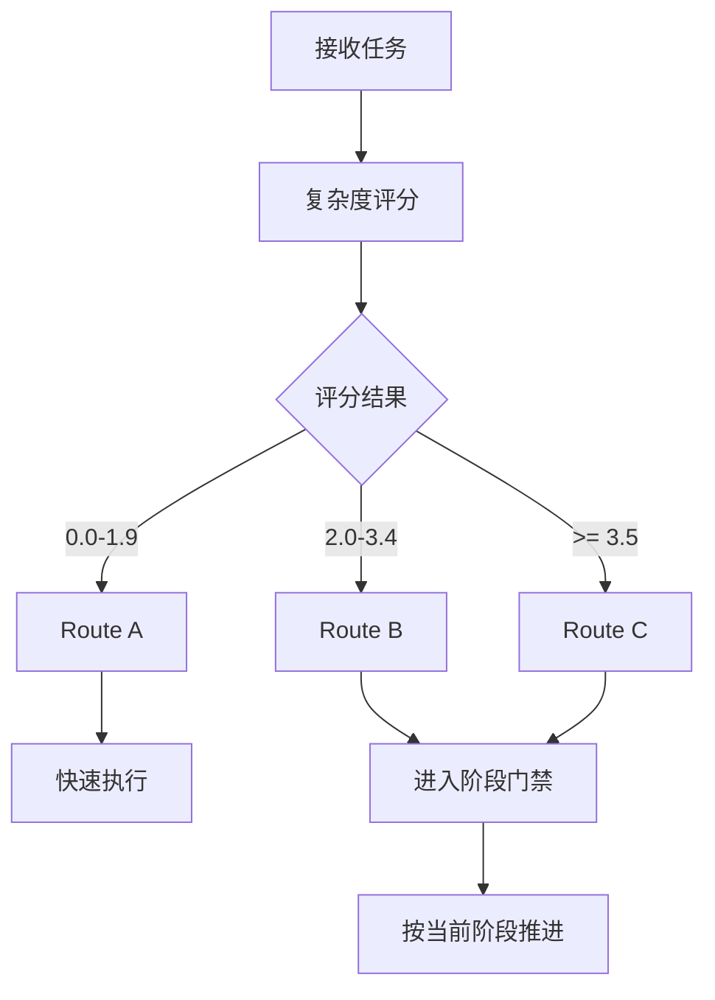

# 2. 路由决策逻辑

## 概述

路由决策分两层：

1. 先决定走 Route A / B / C
2. 对 Route B / Route C 再决定当前卡在哪个阶段门禁

## 路由总览

| 路由 | 评分范围 | 适用任务 |
|------|----------|----------|
| Route A | `0.0-1.9` | 简单修改、明确实现路径 |
| Route B | `2.0-3.4` | 中等复杂度功能、局部重构 |
| Route C | `>= 3.5` | 架构变更、高风险迁移、多阶段任务 |

## 决策流程



## Route A

### 适用条件

- 文件少、影响面小
- 不需要正式设计
- 不需要跨 chat 进度恢复

### 必须做的事

- 用 1-2 句话确认需求理解
- 说明将修改什么
- 修改后验证结果

### 不应做的事

- 不要启动重量级文档流程
- 不要伪装成复杂任务

## Route B

### 适用条件

- 需要正式需求对齐
- 需要整体方案设计
- 不需要多方案竞选

### 强制阶段

1. Stage 0: Repo Grounding
2. Stage 1: Requirements Alignment
3. Stage 2: Technical Design
4. Stage 3: Implementation Planning
5. Stage 4: TDD Execution
6. Stage 5: Acceptance
7. Stage 6: Session Closeout

### Route B 必须包含

- 需求对齐文档与用户确认
- 基于当前代码的整体技术方案
- 至少 2 张图：架构图 + 流程图
- 实现计划确认后再编码
- TDD 执行、fresh verification evidence 与验收

## Route C

### 适用条件

- 架构重构或技术迁移
- 多阶段长链路任务
- 需要多方案评估

### 强制阶段

1. Stage 0: Repo Grounding
2. Stage 1: Requirements Alignment
3. Stage 2: Technical Design
4. Stage 3: Implementation Planning
5. Stage 4: TDD Execution
6. Stage 5: Acceptance
7. Stage 6: Session Closeout

### Route C 必须包含

- requirements gap scan + design challenge
- 架构图 + 数据流图 + 实施流程图
- 10+ 可执行单元及依赖关系
- Stage 4 的 TDD / debugging discipline
- Stage 5 的 fresh verification evidence
- 收尾治理询问

## 阶段门禁（Route B / Route C）

### 当前阶段必须显式展示

首轮和每次恢复时，都必须告诉用户：

- 当前路由
- 当前阶段
- 已确认内容
- 未决问题
- 下一步允许动作
- 当前不会做什么

### Gate 规则

- 未完成 `requirements-alignment.md` 且未获得确认，不得创建 `design.md`
- 未完成 `design.md` 且未获得确认，不得创建 `implementation-plan.md`
- 未完成 `implementation-plan.md` 且未获得确认，不得开始代码编写
- 未完成 `acceptance.md` 与 `session-summary.md`，不得宣告任务完成

### 双重确定协议

阶段推进默认要求双重确定：

1. AI 先显式发起阶段确认，明确：
   - 当前阶段
   - 待进入阶段
   - 当前主文档
   - 等待用户确认的事项
   - 未确认前不会做什么
2. 用户再用带目标阶段名的明确确认语句回复，例如：
   - `确认进入设计阶段`
   - `确认进入实现计划阶段`
   - `确认开始编码`

以下回复默认不构成阶段确认：

- `继续`
- `好的`
- `按这个来`
- 对需求、约束或路径的补充说明

收到有效确认后，必须把确认原话落到主文档或 `INDEX.md`，再推进。

## 升级 / 降级规则

### 升级到更重流程

- 从 Route A 升级到 Route B
  - 发现跨模块影响
  - 发现需要正式设计
  - 发现任务需要里程碑和恢复

- 从 Route B 升级到 Route C
  - 发现需要 Brainstorm
  - 发现高风险迁移或多方案竞争
  - 发现影响范围远超初始判断

### 允许降级的前提

- 用户与 AI 共同确认需求已明显缩小
- 已记录降级原因
- 不会破坏已完成阶段的门禁逻辑

## 首轮响应示例

```markdown
命中的 skill：`complex-task-solver`、`workspace-structure-manager`

使用顺序：
1. `complex-task-solver` 负责路由和阶段控制
2. `workspace-structure-manager` 负责 session 和文档载体

当前评估：
- 综合评分：3.9
- 建议流程：Route C
- 当前阶段：Stage 1 Requirements Alignment

当前不会做什么：
- 在需求文档确认前不会进入设计
- 在设计确认前不会拆实现计划和开始编码
```

## 参考资料

- [1. 复杂度评分详解](1-complexity-scoring.md)
- [4. Route B 标准流程](4-route-b-standard-flow.md)
- [5. Route C 完整流程](5-route-c-complete-flow.md)
