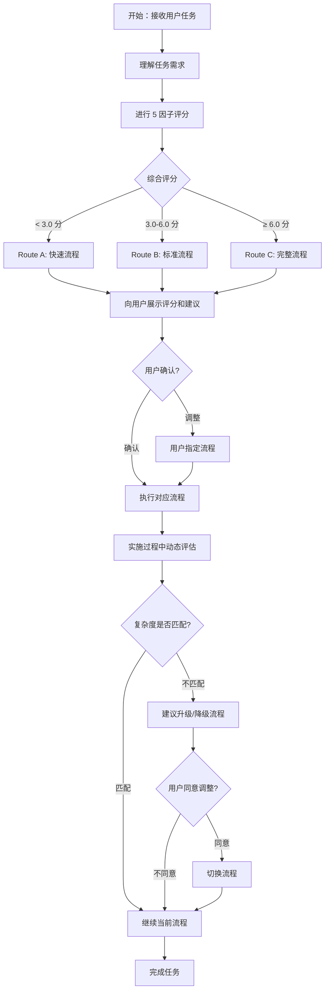

# 2. 路由决策逻辑

## 概述

路由决策是根据复杂度评分，将任务分配到合适流程的机制。Complex Task Solver 提供三条路由：

- **Route A**：快速流程（< 3.0 分）
- **Route B**：标准流程（3.0-6.0 分）
- **Route C**：完整流程（≥ 6.0 分）

## 路由决策流程图



---

## Route A: 快速流程

### 适用条件

**评分范围**：< 3.0 分

**典型特征**：
- 1-5 个文件
- 单模块内部变更
- 无架构变更
- 需求明确清晰
- 无明显技术风险

### 流程概览

```
需求理解 → 简化实现计划 → 执行 → 验证
```

**时间预估**：< 30 分钟

### 适用场景

- ✅ 修复样式问题
- ✅ 修复明确的 bug
- ✅ 简单的功能增强
- ✅ 文档更新
- ✅ 配置调整

### 不适用场景

- ❌ 涉及多个模块
- ❌ 需要架构设计
- ❌ 需求不清晰
- ❌ 高风险操作

### 强制规则

**必须跳过的阶段**：
- 不需要 Brainstorm
- 不需要完整技术讨论
- 不需要影响面分析
- 不需要详细实现计划

**必须保留的阶段**：
- 需求理解（简短）
- 执行验证

---

## Route B: 标准流程

### 适用条件

**评分范围**：3.0-6.0 分

**典型特征**：
- 6-15 个文件
- 2-3 个模块
- 局部架构调整
- 需求部分模糊
- 可控技术风险

### 流程概览

```
需求对齐 → 技术方案讨论 → 设计输出 → 影响面分析（简化版）→ 实现计划 → 执行 → 进度追踪
```

**时间预估**：1-2 小时

### 适用场景

- ✅ 新增中等功能
- ✅ 模块级别重构
- ✅ API 接口设计
- ✅ 数据库表设计
- ✅ 性能优化

### 不适用场景

- ❌ 全局架构重构
- ❌ 高风险技术迁移
- ❌ 需要多方案评估

### 强制规则

**必须包含的阶段**：
- 需求对齐（确认细节）
- 技术方案讨论（关键技术点）
- 设计输出（架构图）
- 简化影响面分析（代码 + 功能）
- 实现计划（5-10 步骤）

**可选阶段**：
- Brainstorm（仅当方案不明确时）
- 完整影响面分析（可简化）

**必须跳过的阶段**：
- 不需要完整的 6W2H 讨论
- 不需要多图表设计（只需架构图）

---

## Route C: 完整流程

### 适用条件

**评分范围**：≥ 6.0 分

**典型特征**：
- >15 个文件
- >3 个模块
- 全局架构重构
- 需求高度模糊
- 高风险或未知领域

### 流程概览

```
需求对齐 → Brainstorm → 完整技术讨论 → 设计输出 → 完整影响面分析 → 任务分解 → 实现计划 → 并行执行 → 进度追踪 → 错误恢复
```

**时间预估**：> 2 小时或跨多个 Chat

### 适用场景

- ✅ 全局架构重构
- ✅ 技术栈迁移
- ✅ 大规模功能开发
- ✅ 数据迁移
- ✅ 系统级性能优化

### 不适用场景

- ❌ 简单修复
- ❌ 单文件变更

### 强制规则

**必须包含的阶段**：
- 需求对齐（深度讨论）
- **Brainstorm**（2-3 个方案评估）
- 完整技术讨论（6W2H + 风险 + 影响）
- 设计输出（架构图 + 数据流图 + 流程图）
- 完整影响面分析（6 个维度）
- 任务分解（10+ 可执行单元）
- 实现计划（包含依赖和优先级）
- 并行执行（独立任务并行）
- 进度追踪（实时更新文档）
- 错误恢复（动态子任务管理）

**不可跳过**：
- Brainstorm 阶段（即使方案看似明确，也要评估 2-3 个方案）

---

## 路由调整机制

### 何时调整路由

**升级流程**（从低到高）：

| 触发条件 | 从 | 到 | 理由 |
|---------|----|----|------|
| 发现架构变更需求 | A | B/C | 需要设计阶段 |
| 发现跨模块影响 | A | B | 需要影响分析 |
| 发现高风险操作 | A/B | C | 需要完整评估 |
| 实施中发现复杂依赖 | A/B | C | 需要任务分解 |

**降级流程**（从高到低）：

| 触发条件 | 从 | 到 | 理由 |
|---------|----|----|------|
| 需求简化 | C | B | 降低复杂度 |
| 风险降低 | C | B | 不需要完整流程 |
| 用户要求快速交付 | B/C | A | 时间优先 |

### 调整流程

1. **AI 主动识别**：
   - 实施过程中发现复杂度不匹配
   - 立即暂停当前流程

2. **向用户说明**：
   - 说明为什么需要调整
   - 展示当前进度和已完成内容
   - 说明调整后的流程差异

3. **等待用户确认**：
   - 用户同意 → 切换流程
   - 用户拒绝 → 继续当前流程（但记录风险）

4. **切换流程**：
   - 保留已完成的阶段成果
   - 从新流程的下一阶段继续

### 调整示例

**示例：从 Route A 升级到 Route B**

```markdown
## ⚠️ 流程调整建议

在实施过程中，我发现这个任务的复杂度高于初始评估：

**原因**：
- 发现需要修改 8 个文件（原本以为只有 2 个）
- 涉及前端和后端两个模块的协作
- 需要设计新的 API 接口

**建议**：从 Route A（快速流程）升级到 Route B（标准流程）

**调整后的流程**：
1. ✅ 需求理解（已完成）
2. 📝 技术方案讨论（新增）
3. 📝 设计输出（新增）
4. 📝 影响面分析（新增）
5. 📝 实现计划（新增）
6. 📝 执行
7. 📝 进度追踪（新增）

**预计额外时间**：约 30-60 分钟

是否同意升级流程？
```

---

## 边界案例处理

### 情况 1：评分接近阈值

**场景**：综合评分为 2.8 或 3.2

**处理方式**：
1. 展示评分结果
2. 说明两种流程的差异
3. 询问用户偏好
4. 记录用户选择理由

**示例**：
```markdown
## 复杂度评估

综合评分：2.8 分（接近 Route B 的阈值 3.0）

**Route A（快速流程）**：
- 时间：< 30 分钟
- 风险：可能遗漏设计阶段

**Route B（标准流程）**：
- 时间：1-2 小时
- 优势：包含完整设计和影响分析

你倾向于使用哪个流程？
```

---

### 情况 2：用户明确指定流程

**场景**：用户说"快速实现就行"或"需要完整设计"

**处理方式**：
1. 尊重用户选择
2. 但仍展示评分结果和建议
3. 提醒可能的风险（如果不匹配）
4. 记录用户选择

**示例**：
```markdown
## 用户指定流程

你要求使用快速流程，我会按 Route A 执行。

不过根据我的评估，这个任务的综合评分为 3.5 分，建议使用 Route B（标准流程）：
- 涉及 10 个文件
- 跨前端和后端两个模块
- 建议进行影响面分析

如果在实施过程中发现复杂度较高，我会及时告知你。
```

---

### 情况 3：多因子评分差异大

**场景**：fileCount=5 但 archChange=5（文件少但架构变更大）

**处理方式**：
1. 综合评分会平衡各个因子
2. 但特别关注高分因子（如 archChange=5）
3. 向用户解释为什么选择某个路由

**示例**：
```markdown
## 复杂度评估

虽然涉及的文件数量不多（5 个文件），但这是一个架构级别的重构任务：

| 因子 | 分数 | 说明 |
|------|------|------|
| fileCount | 2 | 5 个文件 |
| archChange | 5 | 全局架构重构 |
| risk | 4 | 高风险操作 |

**综合评分**：3.6 分

**建议流程**：Route C（完整流程）

理由：即使文件数量不多，但架构变更和风险评分都很高，建议使用完整流程，包含 Brainstorm 和完整影响分析。
```

---

## 强制规则总结

### Route A 必须跳过

- ❌ Brainstorm
- ❌ 完整技术讨论（6W2H）
- ❌ 影响面分析
- ❌ 任务分解
- ❌ 详细实现计划

### Route B 必须包含

- ✅ 需求对齐
- ✅ 技术方案讨论
- ✅ 设计输出（至少架构图）
- ✅ 简化影响面分析（代码 + 功能）
- ✅ 实现计划（5-10 步骤）

### Route C 必须包含

- ✅ 需求对齐（深度）
- ✅ **Brainstorm**（不可跳过）
- ✅ 完整技术讨论（6W2H + 风险 + 影响）
- ✅ 设计输出（架构图 + 数据流图 + 流程图）
- ✅ 完整影响面分析（6 个维度）
- ✅ 任务分解（10+ 单元）
- ✅ 实现计划（依赖 + 优先级）
- ✅ 并行执行
- ✅ 进度追踪
- ✅ 错误恢复

---

## 最佳实践

1. **评分透明化**：始终向用户展示评分结果和理由
2. **用户确认**：关键决策点等待用户确认
3. **动态调整**：发现不匹配时及时调整
4. **记录理由**：记录路由选择和调整的理由
5. **灵活应对**：尊重用户选择，但提醒风险

---

## 常见问题

### Q1: 用户要求快速实现，但评分很高？

**A**: 向用户说明风险，但尊重选择：
- 展示评分结果（如 8.0 分）
- 说明快速流程的风险（可能遗漏重要设计）
- 建议至少进行简化的影响分析
- 记录用户选择

### Q2: 实施中发现复杂度远高于预期？

**A**: 立即暂停并调整：
- 向用户说明发现的新复杂性
- 建议升级流程
- 如果用户拒绝，记录风险并继续

### Q3: 如何判断是否需要 Brainstorm？

**A**: 以下情况必须 Brainstorm：
- 综合评分 ≥ 6.0（Route C）
- 技术方案有多种可能
- 用户明确要求方案评估

---

## 参考资料

- [1. 复杂度评分详解](1-complexity-scoring.md) - 了解如何计算综合评分
- [3. Route A 快速流程](3-route-a-fast-flow.md) - Route A 详细流程
- [4. Route B 标准流程](4-route-b-standard-flow.md) - Route B 详细流程
- [5. Route C 完整流程](5-route-c-complete-flow.md) - Route C 详细流程
