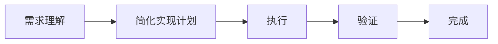

# 3. Route A - 快速流程

## 概述

Route A 是为简单任务设计的快速流程，适用于综合评分 < 3.0 的任务。

**核心理念**：快速理解、快速实现、快速验证

## 适用场景

- 修复样式问题
- 修复明确的 bug
- 简单的功能增强
- 文档更新
- 配置调整

## 流程图



**预计时间**：< 30 分钟

---

## 阶段 1: 需求理解

### 目标

快速理解用户需求，确认实现路径清晰。

### 检查清单

- [ ] 理解用户想要什么结果
- [ ] 确认涉及哪些文件
- [ ] 确认是否有明确的验收标准
- [ ] 确认是否有技术依赖

### 输出

一段简短的需求理解确认：

```markdown
## 需求理解

你想要：[描述用户目标]

我的理解是：
- 修改文件：[文件列表]
- 实现内容：[具体修改]
- 验收标准：[如何验证]

开始实现？
```

### 示例

**用户需求**："修复登录页面按钮颜色不一致"

**AI 输出**：
```markdown
## 需求理解

你想要：统一登录页面的按钮颜色

我的理解是：
- 修改文件：`src/pages/Login.tsx`
- 实现内容：将所有按钮颜色统一为 `#0066cc`
- 验收标准：所有按钮颜色一致，视觉效果良好

开始实现？
```

---

## 阶段 2: 简化实现计划

### 目标

快速列出 1-3 个实现步骤。

### 格式

```markdown
## 实现计划

1. [步骤 1]
2. [步骤 2]
3. [步骤 3]
```

**注意**：
- 步骤数量：1-3 个
- 不需要详细的验收标准
- 不需要依赖关系分析

### 示例

**任务**："修复登录页面按钮颜色不一致"

**实现计划**：
```markdown
## 实现计划

1. 打开 `src/pages/Login.tsx` 文件
2. 将所有按钮的 `color` 属性统一为 `#0066cc`
3. 运行 dev server 验证效果
```

---

## 阶段 3: 执行

### 目标

快速实现计划中的步骤。

### 原则

- **直接执行**：不需要过多讨论
- **边做边验证**：每个步骤完成后简单验证
- **快速迭代**：发现问题立即修复

### 示例

**执行过程**：

1. **读取文件**
   ```bash
   Read: src/pages/Login.tsx
   ```

2. **修改代码**
   ```bash
   Edit: src/pages/Login.tsx
   - 将 color="#ff0000" 改为 color="#0066cc"
   - 将 color="#00ff00" 改为 color="#0066cc"
   ```

3. **运行验证**
   ```bash
   npm run dev
   ```

---

## 阶段 4: 验证

### 目标

快速验证修改是否符合预期。

### 验证方式

根据任务类型选择：

| 任务类型 | 验证方式 |
|---------|----------|
| 样式修改 | 运行 dev server，目视检查 |
| Bug 修复 | 运行测试用例或手动复现 |
| 功能增强 | 手动测试新功能 |
| 配置调整 | 运行应用验证配置生效 |
| 文档更新 | 阅读文档检查格式和内容 |

### 输出

```markdown
## 验证结果

✅ 验证通过：[验证内容]

或

❌ 验证失败：[失败原因]
```

### 示例

**验证结果**：
```markdown
## 验证结果

✅ 验证通过：
- 运行 `npm run dev` 启动应用
- 登录页面所有按钮颜色统一为 `#0066cc`
- 视觉效果良好

任务完成！
```

---

## 完整示例

### 示例 1：修复样式问题

**用户输入**：
```
修复登录页面按钮颜色不一致的问题
```

**AI 执行**：

```markdown
## 复杂度评估

综合评分：0.2 分 → Route A（快速流程）

---

## 需求理解

你想要：统一登录页面的按钮颜色

我的理解是：
- 修改文件：`src/pages/Login.tsx`
- 实现内容：将所有按钮颜色统一为 `#0066cc`
- 验收标准：所有按钮颜色一致

开始实现？
```

用户确认后：

```markdown
## 实现计划

1. 打开 `src/pages/Login.tsx`
2. 统一按钮颜色为 `#0066cc`
3. 运行 dev server 验证

---

## 执行

[读取文件]
[修改代码]
[运行验证]

---

## 验证结果

✅ 验证通过：所有按钮颜色统一，效果良好

任务完成！
```

---

### 示例 2：修复明确的 Bug

**用户输入**：
```
修复用户点击"提交"按钮时表单未校验的问题
```

**AI 执行**：

```markdown
## 复杂度评估

综合评分：1.2 分 → Route A（快速流程）

---

## 需求理解

你想要：点击"提交"按钮时先校验表单

我的理解是：
- 修改文件：`src/components/Form.tsx`
- 实现内容：在提交前调用表单校验函数
- 验收标准：提交前表单必须通过校验

开始实现？
```

用户确认后：

```markdown
## 实现计划

1. 打开 `src/components/Form.tsx`
2. 在 `handleSubmit` 函数中添加校验逻辑
3. 测试提交流程

---

## 执行

[读取文件]
[修改代码：添加 validateForm() 调用]
[测试]

---

## 验证结果

✅ 验证通过：
- 表单未填写完整时提交被阻止
- 表单填写完整后可以正常提交

任务完成！
```

---

## 注意事项

### 何时不应使用 Route A

如果实施过程中发现以下情况，应升级到 Route B：

- ❌ 涉及文件数量超过 5 个
- ❌ 需要跨模块协作
- ❌ 发现需要架构调整
- ❌ 发现高风险操作

**升级流程示例**：

```markdown
## ⚠️ 流程调整建议

在实施过程中，我发现这个任务的复杂度高于初始评估：

**原因**：
- 需要修改 8 个文件（原本以为只有 1 个）
- 涉及前端和后端两个模块

**建议**：升级到 Route B（标准流程）

是否同意？
```

---

### 常见错误

**错误 1：过度简化需求理解**
- ❌ 没有确认用户需求就开始实现
- ✅ 至少用 1-2 句话确认需求

**错误 2：跳过验证阶段**
- ❌ 修改完代码就说完成
- ✅ 必须运行验证，确认修改生效

**错误 3：强行使用 Route A**
- ❌ 明明很复杂还坚持用快速流程
- ✅ 发现复杂度不匹配时及时升级流程

---

## 最佳实践

1. **快速但不草率**：虽然是快速流程，但需求理解和验证不能省略
2. **及时升级**：发现复杂度不匹配时立即升级流程
3. **简洁输出**：不需要冗长的文档，但关键信息必须包含
4. **边做边验证**：每个步骤完成后简单验证，避免最后才发现问题

---

## 流程检查清单

使用 Route A 前，确认以下条件：

- [ ] 综合评分 < 3.0
- [ ] 涉及文件数量 ≤ 5
- [ ] 单模块内部变更
- [ ] 无架构变更
- [ ] 需求明确清晰
- [ ] 无高风险操作

如果以上条件不满足，考虑使用 Route B 或 Route C。

---

## 参考资料

- [1. 复杂度评分详解](1-complexity-scoring.md) - 了解如何判断是否适合 Route A
- [2. 路由决策逻辑](2-route-decision.md) - 了解何时升级流程
- [4. Route B 标准流程](4-route-b-standard-flow.md) - 升级到 Route B 的完整流程
