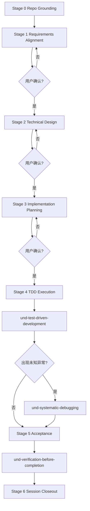

# 4. Route B - 标准流程

## 概述

Route B 适用于综合评分 `2.0-3.4` 的任务。目标是用较低流程成本，换取清晰的需求、整体方案和可执行计划。

## Route B 总流程

## 阶段定义

### Stage 0: Repo Grounding

目标：先理解当前代码，而不是直接凭经验出方案。

必须完成：

- 定位主要入口、模块和边界
- 记录现状行为
- 列出预计受影响模块

产物：可写入 `design.md` 的“当前代码事实”章节

### Stage 1: Requirements Alignment

目标：锁定任务目标、边界、约束、优先级和验收标准。

产物：`requirements-alignment.md`

必须包含：

- 用户原始需求
- 需求理解
- In scope / out of scope
- 约束条件
- 验收标准
- 未决问题
- 用户确认结论

门禁：

- 用户确认前，不得进入设计阶段

### Stage 2: Technical Design

目标：给出基于当前代码的整体方案。

产物：`design.md`

必须包含：

- 当前代码事实
- 目标方案
- 主要改动点
- 风险与回退考虑
- Mermaid 架构图
- Mermaid 实施流程图
- 用户确认结论

门禁：

- 用户确认前，不得开始拆实现计划

### Stage 3: Implementation Planning

目标：把设计拆成可执行步骤，并明确每步如何以 TDD 落地。

产物：`implementation-plan.md`

必须包含：

- 步骤顺序与依赖
- 每步的 `failing test -> Verify RED -> minimal implementation -> Verify GREEN -> refactor -> step acceptance`
- 测试策略
- 例外说明（若某步不适合 TDD）
- 用户确认结论

门禁：

- 用户确认前，不得开始编码

### Stage 4: TDD Execution

目标：按计划执行，并把真实进度写入文档。

产物：`progress-details.md`

必须记录：

- 当前执行的步骤
- 已编写测试
- `Verify RED / Verify GREEN` 结果
- 根因证据、假设与验证动作（如进入调试）
- 新发现的阻塞和动态子任务

默认方法：

- confirmed implementation step 走 `und-test-driven-development`
- 若执行中出现未知异常，切到 `und-systematic-debugging`

### Stage 5: Acceptance

目标：验证“做对了需求”，而不仅是“测试过了代码”。

产物：`acceptance.md`

必须包含：

- 需求映射
- 验收场景与结果
- 回归验证
- fresh verification evidence
- 遗留问题 / defer 项
- 用户确认结论

默认方法：

- completion claim 前走 `und-verification-before-completion`

### Stage 6: Session Closeout

目标：把本次任务收好尾。

产物：`session-summary.md`

必须包含：

- 结果总结
- 关键决策
- 偏差与遗留项
- 候选经验沉淀
- 是否已向用户发起技能治理询问

## Route B 的最低交付要求

- 已确认的 `requirements-alignment.md`
- 已确认的 `design.md`
- 已确认的 `implementation-plan.md`
- 真实执行中的 `progress-details.md`
- 完成后的 `acceptance.md`
- 收尾用的 `session-summary.md`

## 常见错误

- 在需求未确认前先出技术方案
- 在设计未确认前先拆任务或改代码
- 把测试放到实现之后，退化为“先写代码再补测”
- 遇到 bug 后直接盲修，没有先做根因调查
- 完成编码后直接结束，没有做验收和总结

## 参考资料

- [6. 需求对齐流程](6-requirements-alignment.md)
- [10. 设计模板库](10-design-templates.md)
- [12. 实现计划文档](12-implementation-plan.md)
- [13. 进度追踪机制](13-progress-tracking.md)
