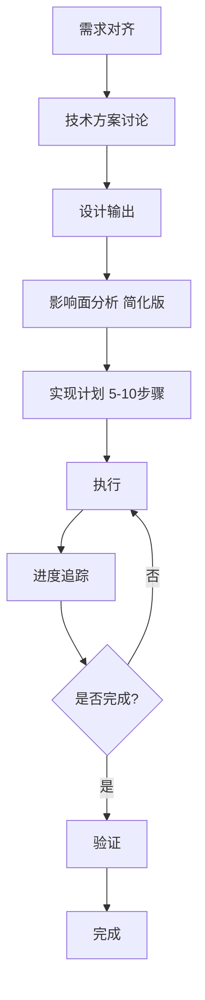

# 4. Route B - 标准流程

## 概述

Route B 是为中等复杂度任务设计的标准流程，适用于综合评分 3.0-6.0 的任务。

**核心理念**：需求对齐、设计先行、分步实现、进度追踪

## 适用场景

- 新增中等功能
- 模块级别重构
- API 接口设计
- 数据库表设计
- 性能优化

## 流程图



**预计时间**：1-2 小时

---

## 阶段 1: 需求对齐

### 目标

与用户深入对齐需求细节，确保理解准确。

### 检查清单

- [ ] **What**：要实现什么功能？
- [ ] **Why**：为什么需要这个功能？
- [ ] **Who**：谁会使用这个功能？
- [ ] **When**：什么时候触发？
- [ ] **Where**：在哪里使用？
- [ ] **验收标准**：如何判断完成？

### 输出格式

```markdown
## 需求对齐

### 核心需求
[用 1-2 句话描述核心需求]

### 详细说明
- **What**：[要实现什么]
- **Why**：[为什么需要]
- **Who**：[谁使用]
- **When**：[何时触发]
- **Where**：[在哪使用]
- **How**：[如何实现（初步想法）]

### 验收标准
1. [标准 1]
2. [标准 2]
3. [标准 3]

### 约束条件
- [约束 1]
- [约束 2]

是否对齐？
```

### 示例

**用户需求**："新增用户权限管理功能"

**AI 输出**：
```markdown
## 需求对齐

### 核心需求
新增用户权限管理功能，支持角色配置和权限分配。

### 详细说明
- **What**：管理员可以创建角色、分配权限、将用户关联到角色
- **Why**：当前系统缺少细粒度权限控制
- **Who**：系统管理员使用
- **When**：用户登录后，在管理后台使用
- **Where**：管理后台 → 用户管理 → 权限管理
- **How**：设计角色表、权限表、用户角色关联表，提供增删改查 API

### 验收标准
1. 可以创建、编辑、删除角色
2. 可以为角色分配权限
3. 可以将用户关联到角色
4. 用户登录后根据角色权限控制功能访问

### 约束条件
- 需要支持多角色（一个用户可以有多个角色）
- 权限粒度为功能级别（如：用户管理、订单管理）

是否对齐？
```

---

## 阶段 2: 技术方案讨论

### 目标

讨论技术实现方案，包括数据库设计、API 设计、前端组件设计。

### 讨论要点

- **数据库设计**：表结构、字段、索引、关系
- **API 设计**：接口列表、请求/响应格式
- **前端设计**：组件结构、状态管理、路由
- **技术选型**：使用的库或框架

### 输出格式

```markdown
## 技术方案

### 数据库设计

**表：roles（角色表）**
| 字段 | 类型 | 说明 |
|------|------|------|
| id | int | 主键 |
| name | varchar(50) | 角色名称 |
| description | text | 角色描述 |
| created_at | timestamp | 创建时间 |

[更多表...]

### API 设计

**1. 创建角色**
- **接口**：`POST /api/roles`
- **请求**：`{ name: string, description: string }`
- **响应**：`{ id: number, name: string, ... }`

[更多接口...]

### 前端设计

**页面**：`/admin/roles`

**组件结构**：
- RoleList（角色列表）
- RoleForm（创建/编辑角色）
- PermissionSelector（权限选择器）

### 技术选型
- 后端：Express + Sequelize ORM
- 前端：React + Ant Design
```

### 示例

```markdown
## 技术方案

### 数据库设计

**表：roles（角色表）**
| 字段 | 类型 | 说明 |
|------|------|------|
| id | int | 主键 |
| name | varchar(50) | 角色名称 |
| description | text | 角色描述 |

**表：permissions（权限表）**
| 字段 | 类型 | 说明 |
|------|------|------|
| id | int | 主键 |
| code | varchar(50) | 权限代码 |
| name | varchar(50) | 权限名称 |

**表：role_permissions（角色权限关联表）**
| 字段 | 类型 | 说明 |
|------|------|------|
| role_id | int | 角色 ID |
| permission_id | int | 权限 ID |

**表：user_roles（用户角色关联表）**
| 字段 | 类型 | 说明 |
|------|------|------|
| user_id | int | 用户 ID |
| role_id | int | 角色 ID |

### API 设计

**1. 创建角色**
- `POST /api/roles`
- Request: `{ name, description }`
- Response: `{ id, name, description }`

**2. 获取角色列表**
- `GET /api/roles`
- Response: `{ roles: [...] }`

**3. 为角色分配权限**
- `POST /api/roles/:id/permissions`
- Request: `{ permission_ids: [1, 2, 3] }`

### 前端设计

**页面**：`/admin/roles`

**组件**：
- RoleList：显示角色列表
- RoleForm：创建/编辑角色表单
- PermissionSelector：权限复选框组

### 技术选型
- 后端：Express + Sequelize
- 前端：React + Ant Design
```

---

## 阶段 3: 设计输出

### 目标

绘制架构图，展示系统设计。

### 输出

使用 Mermaid 绘制架构图。

### 示例

```markdown
## 设计输出

### 架构图

\`\`\`mermaid
graph TB
    User[用户] --> Frontend[前端]
    Frontend --> API[API 层]
    API --> Auth[权限校验中间件]
    Auth --> Controller[控制器]
    Controller --> Service[服务层]
    Service --> DB[(数据库)]

    subgraph 数据库表
        DB --> Roles[roles 角色表]
        DB --> Permissions[permissions 权限表]
        DB --> RolePerms[role_permissions 关联表]
        DB --> UserRoles[user_roles 关联表]
    end
\`\`\`

### 数据流图（可选）

\`\`\`mermaid
sequenceDiagram
    User->>Frontend: 创建角色
    Frontend->>API: POST /api/roles
    API->>Auth: 验证权限
    Auth->>Controller: 通过
    Controller->>Service: createRole()
    Service->>DB: INSERT roles
    DB-->>Service: 返回 role_id
    Service-->>Frontend: 返回角色信息
    Frontend-->>User: 显示创建成功
\`\`\`
```

---

## 阶段 4: 影响面分析（简化版）

### 目标

分析任务对系统的影响，重点关注代码和功能。

### 分析维度

| 维度 | 说明 |
|------|------|
| **代码影响** | 涉及哪些文件和模块 |
| **功能影响** | 影响哪些现有功能 |

### 输出格式

```markdown
## 影响面分析

### 代码影响
- **新增文件**：[列表]
- **修改文件**：[列表]
- **涉及模块**：[列表]

### 功能影响
- **影响现有功能**：[是/否，如果是，列出哪些功能]
- **向后兼容**：[是/否]
```

### 示例

```markdown
## 影响面分析

### 代码影响

**新增文件**：
- `src/models/Role.ts`
- `src/models/Permission.ts`
- `src/controllers/RoleController.ts`
- `src/services/RoleService.ts`
- `src/pages/Admin/Roles.tsx`
- `src/components/RoleForm.tsx`

**修改文件**：
- `src/routes/api.ts`（新增路由）
- `src/middleware/auth.ts`（新增权限校验）

**涉及模块**：
- 后端：用户模块、权限模块
- 前端：管理后台模块

### 功能影响

**影响现有功能**：
- 是，需要在现有用户登录逻辑中加载用户角色和权限
- 需要在各功能模块中添加权限校验

**向后兼容**：
- 是，现有用户默认为普通用户角色
```

---

## 阶段 5: 实现计划

### 目标

将任务拆分为 5-10 个可执行步骤。

### 输出格式

```markdown
## 实现计划

### 总体概览
- **目标**：[总体目标]
- **策略**：[实现策略]
- **预计时间**：[时间估算]

### 详细步骤

#### 步骤 1: [步骤名称]
- **优先级**：P0 / P1 / P2
- **任务清单**：
  - [ ] 子任务 1
  - [ ] 子任务 2
- **验收标准**：[...]

#### 步骤 2: [步骤名称]
...
```

### 示例

```markdown
## 实现计划

### 总体概览
- **目标**：实现用户权限管理功能
- **策略**：先实现后端 API，再实现前端页面
- **预计时间**：2 小时

### 详细步骤

#### 步骤 1: 创建数据库表结构
- **优先级**：P0
- **任务清单**：
  - [ ] 创建 roles 表
  - [ ] 创建 permissions 表
  - [ ] 创建 role_permissions 表
  - [ ] 创建 user_roles 表
- **验收标准**：数据库迁移成功

#### 步骤 2: 实现后端 Model
- **优先级**：P0
- **任务清单**：
  - [ ] 创建 Role Model
  - [ ] 创建 Permission Model
  - [ ] 配置表关联关系
- **验收标准**：Model 可以正常查询

#### 步骤 3: 实现后端 Service
- **优先级**：P0
- **任务清单**：
  - [ ] 实现 RoleService
  - [ ] 实现权限校验逻辑
- **验收标准**：Service 单元测试通过

#### 步骤 4: 实现后端 Controller 和 API
- **优先级**：P0
- **任务清单**：
  - [ ] 实现 RoleController
  - [ ] 配置 API 路由
- **验收标准**：API 可以正常访问

#### 步骤 5: 实现前端组件
- **优先级**：P1
- **任务清单**：
  - [ ] 创建 RoleList 组件
  - [ ] 创建 RoleForm 组件
  - [ ] 创建 PermissionSelector 组件
- **验收标准**：组件正常渲染

#### 步骤 6: 集成前端页面
- **优先级**：P1
- **任务清单**：
  - [ ] 创建 /admin/roles 页面
  - [ ] 集成各组件
  - [ ] 调用后端 API
- **验收标准**：页面功能正常

#### 步骤 7: 测试和优化
- **优先级**：P2
- **任务清单**：
  - [ ] 端到端测试
  - [ ] 修复发现的问题
  - [ ] 代码优化
- **验收标准**：所有功能正常
```

---

## 阶段 6: 执行

### 目标

按实现计划执行各步骤。

### 原则

- **按优先级执行**：P0 → P1 → P2
- **实时更新进度**：每完成一个步骤更新 implementation-plan.md
- **边做边验证**：每个步骤完成后验证

---

## 阶段 7: 进度追踪

### 目标

实时追踪实现进度，支持跨 Chat 断点续传。

### 文档结构

使用 `implementation-plan.md` 文件追踪进度：

```markdown
# 实现计划：用户权限管理功能

## 总体进度
- **已完成**：3 个步骤
- **进行中**：1 个步骤
- **待开始**：3 个步骤
- **总体进度**：43%

## 详细步骤

### 步骤 1: 创建数据库表结构
- **状态**：✅ 已完成
- **完成时间**：2026-03-09 10:30

### 步骤 2: 实现后端 Model
- **状态**：✅ 已完成
- **完成时间**：2026-03-09 10:45

### 步骤 3: 实现后端 Service
- **状态**：🚧 进行中
- **任务清单**：
  - [x] 实现 RoleService
  - [ ] 实现权限校验逻辑

### 步骤 4: 实现后端 Controller 和 API
- **状态**：⏳ 待开始
...
```

---

## 完整示例

请参考 SKILL.md 中的"场景 2：中等需求 (Route B)"示例。

---

## 注意事项

### 何时升级到 Route C

如果实施过程中发现以下情况，应升级到 Route C：

- ❌ 涉及文件数量超过 15 个
- ❌ 需要 Brainstorm 多个方案
- ❌ 发现全局架构重构需求
- ❌ 发现极高风险操作

---

## 最佳实践

1. **需求对齐充分**：不要急于实现，先确保需求理解准确
2. **设计先行**：先画图再写代码
3. **分步实现**：按实现计划逐步执行
4. **实时追踪**：及时更新进度文档
5. **灵活调整**：发现不匹配时及时升级流程

---

## 参考资料

- [6. 需求对齐流程](6-requirements-alignment.md) - 详细的需求对齐方法
- [10. 设计模板库](10-design-templates.md) - Mermaid 架构图模板
- [12. 实现计划文档](12-implementation-plan.md) - 实现计划文档结构
- [13. 进度追踪机制](13-progress-tracking.md) - 进度追踪详细说明
