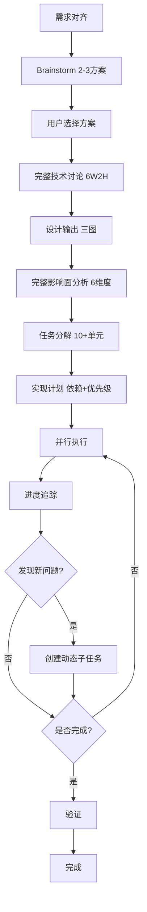

# 5. Route C - 完整流程

## 概述

Route C 是为复杂任务设计的完整流程，适用于综合评分 ≥ 6.0 的任务。

**核心理念**：多方案评估、完整设计、任务分解、并行执行、动态管理

## 适用场景

- 全局架构重构
- 技术栈迁移
- 大规模功能开发
- 数据迁移
- 系统级性能优化

## 流程图



**预计时间**：> 2 小时或跨多个 Chat

---

## 阶段 1: 需求对齐（深度）

与 Route B 相同，但更深入。

### 检查清单（5 维度）

参考 [6. 需求对齐流程](6-requirements-alignment.md)

- [ ] **目标清晰度**：目标是否明确？
- [ ] **范围明确性**：边界是否清楚？
- [ ] **约束条件**：有哪些限制？
- [ ] **优先级**：什么最重要？
- [ ] **验收标准**：如何判断完成？

---

## 阶段 2: Brainstorm（必须）

### 目标

生成 2-3 个候选方案，并从多个维度评估。

### 流程

1. **分析需求和约束**
2. **生成 2-3 个候选方案**
3. **从三个维度评估每个方案**：
   - 优点/缺点
   - 技术风险
   - 实施成本（时间、复杂度）
4. **提供 AI 推荐方案和理由**
5. **等待用户选择**

### 输出格式

```markdown
## Brainstorm - 方案评估

### 分析需求
你想实现 [X]，使得 [Y]，约束是 [Z]。

---

### 方案 1: [方案名称]

**思路**：[简要描述]

**优点**：
- [+] 优点 1
- [+] 优点 2

**缺点**：
- [-] 缺点 1
- [-] 缺点 2

**技术风险**：[评估风险等级和内容]

**实施成本**：
- 时间：[预估]
- 复杂度：[高/中/低]

---

### 方案 2: [方案名称]

[同上]

---

### 方案 3: [方案名称]

[同上]

---

### AI 推荐

基于 [评估标准]，建议选择**方案 X**。

**理由**：
- [理由 1]
- [理由 2]
- [理由 3]

---

请选择你偏好的方案（1/2/3），或提出新的想法。
```

### 示例

**任务**："REST API 迁移到 GraphQL"

```markdown
## Brainstorm - 方案评估

### 分析需求
你想将整个数据层从 REST API 迁移到 GraphQL，以提升前端数据获取的灵活性，约束是需要保持系统稳定，避免服务中断。

---

### 方案 1: 渐进式迁移

**思路**：保留 REST API，逐步添加 GraphQL 接口，允许两者共存，最后再移除 REST。

**优点**：
- [+] 风险最低，可以逐模块迁移
- [+] 出问题可以快速回滚
- [+] 团队有时间学习 GraphQL

**缺点**：
- [-] 迁移周期长（可能需要数周）
- [-] 需要维护两套系统
- [-] 代码冗余

**技术风险**：低

**实施成本**：
- 时间：3-4 周
- 复杂度：中

---

### 方案 2: 并行双写

**思路**：同时提供 REST 和 GraphQL 两套接口，前端逐步切换到 GraphQL。

**优点**：
- [+] 前端可以按需切换
- [+] 两套系统独立，互不影响

**缺点**：
- [-] 需要维护两套系统
- [-] 数据一致性风险
- [-] 资源消耗大

**技术风险**：中

**实施成本**：
- 时间：2-3 周
- 复杂度：高

---

### 方案 3: 一次性切换

**思路**：快速实现 GraphQL，选择一个低峰期一次性切换。

**优点**：
- [+] 迁移周期短（1-2 周）
- [+] 不需要维护两套系统
- [+] 代码简洁

**缺点**：
- [-] 风险极高，出问题影响全系统
- [-] 回滚困难
- [-] 需要全面测试

**技术风险**：高

**实施成本**：
- 时间：1-2 周
- 复杂度：高

---

### AI 推荐

基于风险控制和稳定性，建议选择**方案 1（渐进式迁移）**。

**理由**：
- 风险最低，可以逐模块验证
- 出问题可以快速回滚到 REST
- 团队有足够时间学习 GraphQL
- 虽然时间长，但稳定性最好

---

请选择你偏好的方案（1/2/3），或提出新的想法。
```

---

## 阶段 3: 完整技术讨论

### 目标

进行完整的技术讨论，使用 6W2H + 风险 + 影响 框架。

### 讨论框架

参考 [7. 完整性检查清单](7-completeness-checklist.md)

- **What**：要做什么？
- **Why**：为什么做？
- **Who**：谁参与？
- **When**：何时做？
- **Where**：在哪做？
- **Which**：选择哪个方案？
- **How**：如何实现？
- **How much**：成本多少？
- **风险评估**：有哪些风险？
- **影响评估**：影响哪些方面？

---

## 阶段 4: 设计输出（三图）

### 目标

绘制完整的设计图表。

### 必需图表

1. **架构图**：系统整体架构
2. **数据流图**：数据如何流动
3. **实施流程图**：实施步骤和顺序

### 示例

参考 [10. 设计模板库](10-design-templates.md)

---

## 阶段 5: 完整影响面分析

### 目标

从 6 个维度分析任务对系统的影响。

### 分析维度

1. **代码影响**：涉及哪些文件和模块
2. **功能影响**：影响哪些现有功能
3. **性能影响**：对性能的影响
4. **用户体验影响**：对用户的影响
5. **依赖影响**：对其他系统的影响
6. **风险影响**：可能的风险

参考 [11. 影响面分析](11-impact-analysis.md)

---

## 阶段 6: 任务分解

### 目标

将任务拆分为 10+ 可执行单元。

### 分解原则

- **独立性**：任务之间尽量独立
- **可并行性**：识别可并行执行的任务
- **优先级**：明确每个任务的优先级
- **依赖关系**：明确任务之间的依赖

参考 [9. 任务分解策略](9-task-breakdown.md)

### 示例

**任务**："REST API 迁移到 GraphQL"

```markdown
## 任务分解

### 任务列表

#### 任务 1: 设置 GraphQL 服务器（P0）
- **依赖**：无
- **可并行**：否
- **子任务**：
  - 安装 Apollo Server
  - 配置 GraphQL Schema
  - 配置 Resolver 基础结构

#### 任务 2: 设计 GraphQL Schema（P0）
- **依赖**：任务 1
- **可并行**：否
- **子任务**：
  - 定义 User Type
  - 定义 Order Type
  - 定义 Query 和 Mutation

#### 任务 3: 迁移用户模块（P0）
- **依赖**：任务 2
- **可并行**：可以与任务 4 并行
- **子任务**：
  - 实现 User Resolver
  - 实现用户相关 Query
  - 实现用户相关 Mutation
  - 前端切换到 GraphQL

#### 任务 4: 迁移订单模块（P0）
- **依赖**：任务 2
- **可并行**：可以与任务 3 并行
- **子任务**：
  - 实现 Order Resolver
  - 实现订单相关 Query
  - 实现订单相关 Mutation
  - 前端切换到 GraphQL

#### 任务 5: 迁移产品模块（P1）
- **依赖**：任务 2
- **可并行**：可以与任务 3/4 并行
- **子任务**：
  - 实现 Product Resolver
  - 实现产品相关 Query
  - 前端切换到 GraphQL

#### 任务 6: 添加 DataLoader 优化 N+1 查询（P1）
- **依赖**：任务 3/4/5
- **可并行**：否
- **子任务**：
  - 分析 N+1 查询问题
  - 实现 DataLoader
  - 验证性能提升

#### 任务 7: 添加缓存层（P1）
- **依赖**：任务 6
- **可并行**：否
- **子任务**：
  - 设计缓存策略
  - 实现 Redis 缓存
  - 验证缓存效果

#### 任务 8: 集成测试（P0）
- **依赖**：任务 3/4/5
- **可并行**：否
- **子任务**：
  - 编写端到端测试
  - 测试所有 GraphQL Query/Mutation
  - 验证与 REST 的一致性

#### 任务 9: 移除 REST API（P2）
- **依赖**：任务 8
- **可并行**：否
- **子任务**：
  - 确认所有前端已切换到 GraphQL
  - 移除 REST 路由
  - 移除相关代码

#### 任务 10: 文档更新（P2）
- **依赖**：任务 9
- **可并行**：可以提前开始
- **子任务**：
  - 更新 API 文档
  - 更新开发者指南
  - 更新架构文档
```

---

## 阶段 7: 实现计划

### 目标

基于任务分解，创建详细的实现计划。

### 文档结构

参考 [12. 实现计划文档](12-implementation-plan.md)

包含：
- 总体概览
- 总体进度
- 详细步骤（每个步骤包含状态、优先级、依赖、任务清单、验收标准）
- 动态子任务

---

## 阶段 8: 并行执行

### 目标

按实现计划并行执行独立任务。

### 并行策略

识别可并行的任务：
- 任务 3（用户模块）和任务 4（订单模块）可并行
- 任务 3/4/5（各模块迁移）可并行
- 任务 10（文档）可提前开始

### 注意事项

- 确保任务之间无强依赖
- 定期同步进度
- 及时识别和解决冲突

---

## 阶段 9: 进度追踪

### 目标

实时追踪实现进度，支持跨 Chat 断点续传。

### 追踪机制

参考 [13. 进度追踪机制](13-progress-tracking.md)

- 实时更新 `implementation-plan.md`
- 记录总体进度百分比
- 支持跨 Chat 恢复

---

## 阶段 10: 动态子任务管理

### 目标

实施过程中发现新问题时，创建动态子任务。

### 何时创建子任务

- 发现新的技术问题
- 发现遗漏的功能点
- 发现需要额外的优化

### 子任务格式

```markdown
## 动态子任务

### 子任务 A（发现于步骤 3）
- **描述**：发现需要添加 DataLoader 优化 N+1 查询
- **优先级**：P1
- **状态**：⏳ 待开始
- **依赖**：步骤 3、4、5 完成后

### 子任务 B（发现于步骤 5）
- **描述**：发现产品模块需要额外的图片缓存
- **优先级**：P2
- **状态**：⏳ 待开始
```

---

## 阶段 11: 错误恢复

### 目标

实施过程中遇到错误时，启动错误恢复机制。

### 4 层恢复策略

参考 [14. 错误恢复协议](14-error-recovery.md)

1. **L1: 重试**：技术性问题自动重试（最多 3 次）
2. **L2: 简化**：降低要求（如：用文字代替架构图）
3. **L3: 跳过**：标记待补充，继续下一阶段
4. **L4: 回退**：回退到问题阶段重新设计

---

## 完整示例

请参考 SKILL.md 中的"场景 3：复杂需求 (Route C)"示例。

---

## 最佳实践

1. **Brainstorm 不可跳过**：即使方案看似明确，也要评估 2-3 个方案
2. **完整设计**：三图必须包含（架构图 + 数据流图 + 流程图）
3. **任务分解充分**：至少 10+ 可执行单元
4. **识别并行机会**：最大化并行执行效率
5. **动态管理**：发现新问题及时创建子任务

---

## 参考资料

- [8. Brainstorm 协议](8-brainstorm-protocol.md) - Brainstorm 详细流程
- [7. 完整性检查清单](7-completeness-checklist.md) - 6W2H + 风险 + 影响
- [9. 任务分解策略](9-task-breakdown.md) - 任务分解详细方法
- [10. 设计模板库](10-design-templates.md) - 三图模板
- [11. 影响面分析](11-impact-analysis.md) - 6 维度影响分析
- [12. 实现计划文档](12-implementation-plan.md) - 实现计划文档结构
- [13. 进度追踪机制](13-progress-tracking.md) - 进度追踪详细说明
- [14. 错误恢复协议](14-error-recovery.md) - 错误恢复详细说明
