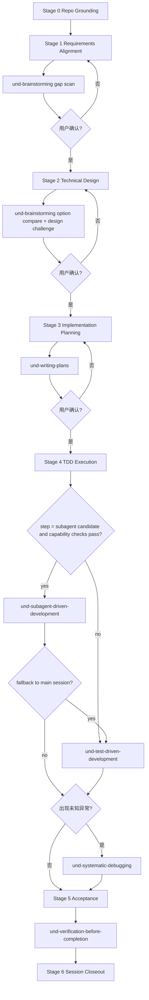

# 5. Route C - 完整流程

## 概述

Route C 适用于综合评分 `>= 3.5` 的任务。典型场景包括架构重构、技术迁移、跨模块长链路开发、高风险任务。

Phase 2 起，Route C 继续使用统一的 `Stage 0-6` 门禁模型，但会在其中显式调度方法型 skill：

- `und-brainstorming`
- `und-writing-plans`
- `und-subagent-driven-development`
- `und-test-driven-development`
- `und-systematic-debugging`
- `und-verification-before-completion`

## Route C 总流程

## 兼容性说明

- `complex-task-solver/SKILL.md` 的统一阶段状态机仍以 `Stage 0-6` 为准。
- `und-brainstorming` 不再要求一个单独的持久化主文档阶段。
- Brainstorm 结果默认写入：
  - `requirements-alignment.md` 的 gap scan / 查漏补缺段落
  - `design.md` 的方案比较 / AI 推荐 / design challenge 段落
- 若任务确实需要额外补充材料，可以新增辅助文档，但不能替代正式门禁主文档。

## 阶段定义

### Stage 0: Repo Grounding

必须完成：

- 梳理当前代码架构与关键模块
- 确认真实约束、兼容性边界和现状问题
- 为 requirements gap scan 与设计提供代码事实基础

### Stage 1: Requirements Alignment

产物：`requirements-alignment.md`

必须锁定：

- 目标
- 范围
- 约束
- 优先级
- 验收标准
- 未决问题
- 用户确认结论

Route C 额外要求：

- 默认调用 `und-brainstorming` 做 requirements gap scan
- 如果发现遗漏，必须显式补进“待确认项”或“约束 / 验收 / 未决问题”

### Stage 2: Technical Design

产物：`design.md`

必须包含：

- 当前代码事实
- 选定方案与放弃的方案
- `und-brainstorming` 的候选方案比较与 AI 推荐
- `und-brainstorming` 的 design challenge / completeness review 结论
- 主要改造点
- 风险、回滚和兼容性策略
- Mermaid 架构图
- Mermaid 数据流图
- Mermaid 实施流程图
- 用户确认结论

### Stage 3: Implementation Planning

产物：`implementation-plan.md`

默认由 `und-writing-plans` 生成，必须包含：

- 10+ 可执行单元（或足够细的最小增量）
- 步骤依赖关系
- `前置输入`
- `文件范围`
- `验证命令`
- `预期结果`
- `Step Acceptance`
- `执行模式`
- `Subagent Eligibility`
- `Review Contract`
- TDD 子结构
- 并行执行边界
- 例外说明
- 用户确认结论

### Stage 4: TDD Execution

产物：`progress-details.md`

必须记录：

- 当前执行步骤
- 当前执行模式（主会话 / subagent candidate / fallback）
- 已落地测试
- `Verify RED / Verify GREEN` 结果
- 代码 / 测试 / 重构状态
- subagent dispatch log、implementer status 与 review loop（若进入 orchestration）
- 根因证据、假设与验证动作（若进入调试）
- 动态子任务
- 阻塞项与恢复动作

默认方法：

- Route C 对满足条件的步骤可先调度 `und-subagent-driven-development`
- confirmed implementation step 走 `und-test-driven-development`
- bug、flaky、回归来源不清时走 `und-systematic-debugging`

overlay 规则：

- `und-subagent-driven-development` 不是新顶层阶段，而是 Stage 4 的 execution overlay
- 该 overlay 负责 capability detection、dispatch、review order 与 fallback
- 无真实 subagent / collab 能力时，必须显式写明 fallback，而不是伪装成已经 dispatch

### Stage 5: Acceptance

产物：`acceptance.md`

必须验证：

- 原始需求映射
- 核心业务场景
- 回归场景
- fresh verification evidence
- 风险关闭情况
- 未完成项 / defer 项
- 用户确认结论

默认方法：

- completion claim 前走 `und-verification-before-completion`

### Stage 6: Session Closeout

产物：`session-summary.md`

必须包含：

- 最终结果
- 关键决策回顾
- 偏差与遗留项
- 候选经验沉淀
- 是否已发起 `skills-manager` 治理询问

## Route C 不可跳过的内容

- repo grounding
- requirements gap scan
- 方案比较与 design challenge
- 设计三图
- implementation plan 确认
- TDD execution
- acceptance
- session closeout

## 典型适用任务

- REST -> GraphQL 迁移
- 认证系统重构
- 数据层重构
- 大规模权限模型改造
- 系统级性能改造

## 常见错误

- 未看当前代码就开始方案竞选
- requirements 没查漏就直接进设计
- 设计只有正向方案，没有 challenge
- 计划只有 TODO，没有输入 / 输出 / 验证契约
- 遇到执行异常后直接猜修复，而没有 root-cause tracing
- 在 Acceptance 中复用旧结果，没有 fresh verification evidence
- 编码结束后没有独立验收与收尾

## 参考资料

- [6. 需求对齐流程](6-requirements-alignment.md)
- [8. Brainstorm 协议](8-brainstorm-protocol.md)
- [12. 实现计划文档](12-implementation-plan.md)
- [13. 进度追踪机制](13-progress-tracking.md)
