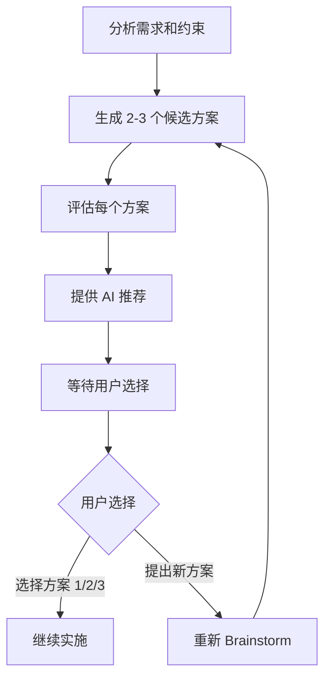

# 8. Brainstorm 协议

## 概述

Brainstorm 是 Route C（完整流程）的必需阶段，用于生成和评估多个技术方案。

## 何时使用 Brainstorm

### 必须使用

- ✅ **综合评分 ≥ 6.0**（Route C）
- ✅ **技术方案有多种可能**
- ✅ **用户明确要求方案评估**

### 不需要使用

- ❌ **综合评分 < 6.0**（Route A/B）
- ❌ **技术方案唯一且明确**
- ❌ **用户明确指定实现方式**

---

## Brainstorm 流程



---

## 阶段 1: 分析需求和约束

### 目标

深入理解需求和约束，为方案生成提供基础。

### 输出格式

```markdown
## 分析需求

你想实现 [X]，使得 [Y]。

**约束条件**：
- [约束 1]
- [约束 2]
- [约束 3]

**关键考虑因素**：
- [因素 1]
- [因素 2]
```

---

## 阶段 2: 生成 2-3 个候选方案

### 目标

生成 2-3 个不同思路的候选方案。

### 方案多样性

确保方案在以下维度有所不同：
- **风险等级**：低风险 vs 高风险
- **实施时间**：快速 vs 完整
- **技术路线**：渐进式 vs 一次性

### 方案模板

```markdown
### 方案 1: [方案名称]

**思路**：[简要描述实现思路]

**关键特点**：
- [特点 1]
- [特点 2]
```

---

## 阶段 3: 评估每个方案

### 评估维度

| 维度 | 说明 |
|------|------|
| **优点** | 方案的优势 |
| **缺点** | 方案的劣势 |
| **技术风险** | 风险等级和内容 |
| **实施成本** | 时间和复杂度 |

### 评估模板

```markdown
### 方案 X: [方案名称]

**思路**：[...]

**优点**：
- [+] 优点 1
- [+] 优点 2

**缺点**：
- [-] 缺点 1
- [-] 缺点 2

**技术风险**：[高/中/低]
- [风险 1]
- [风险 2]

**实施成本**：
- 时间：[预估]
- 复杂度：[高/中/低]
```

---

## 阶段 4: AI 推荐

### 推荐逻辑

基于以下标准推荐方案：
1. **风险优先**：优先推荐低风险方案
2. **稳定性优先**：优先推荐稳定的方案
3. **可回滚性**：优先推荐易于回滚的方案
4. **团队能力**：考虑团队熟悉度

### 推荐模板

```markdown
## AI 推荐

基于 [评估标准]，建议选择**方案 X**。

**理由**：
- [理由 1]
- [理由 2]
- [理由 3]

**权衡说明**：
- [权衡 1]
- [权衡 2]
```

---

## 完整示例

**任务**："REST API 迁移到 GraphQL"

```markdown
## Brainstorm - 方案评估

### 分析需求

你想将整个数据层从 REST API 迁移到 GraphQL，以提升前端数据获取的灵活性。

**约束条件**：
- 需要保持系统稳定，避免服务中断
- 团队对 GraphQL 经验有限
- 预计时间 2-4 周

**关键考虑因素**：
- 迁移风险
- 学习曲线
- 回滚难度

---

### 方案 1: 渐进式迁移

**思路**：保留 REST API，逐步添加 GraphQL 接口，允许两者共存，最后再移除 REST。

**优点**：
- [+] 风险最低，可以逐模块迁移
- [+] 出问题可以快速回滚
- [+] 团队有时间学习 GraphQL

**缺点**：
- [-] 迁移周期长（可能需要数周）
- [-] 需要维护两套系统
- [-] 代码冗余

**技术风险**：低
- 两套系统独立，互不影响

**实施成本**：
- 时间：3-4 周
- 复杂度：中

---

### 方案 2: 并行双写

**思路**：同时提供 REST 和 GraphQL 两套接口，前端逐步切换到 GraphQL。

**优点**：
- [+] 前端可以按需切换
- [+] 两套系统独立

**缺点**：
- [-] 需要维护两套系统
- [-] 数据一致性风险
- [-] 资源消耗大

**技术风险**：中
- 需要确保数据一致性

**实施成本**：
- 时间：2-3 周
- 复杂度：高

---

### 方案 3: 一次性切换

**思路**：快速实现 GraphQL，选择一个低峰期一次性切换。

**优点**：
- [+] 迁移周期短（1-2 周）
- [+] 不需要维护两套系统
- [+] 代码简洁

**缺点**：
- [-] 风险极高，出问题影响全系统
- [-] 回滚困难
- [-] 需要全面测试

**技术风险**：高
- 一旦出问题，影响全系统

**实施成本**：
- 时间：1-2 周
- 复杂度：高

---

## AI 推荐

基于风险控制和稳定性，建议选择**方案 1（渐进式迁移）**。

**理由**：
- 风险最低，可以逐模块验证
- 出问题可以快速回滚到 REST
- 团队有足够时间学习 GraphQL
- 虽然时间长，但稳定性最好

**权衡说明**：
- 方案 2 和方案 3 虽然更快，但风险较高
- 考虑到团队对 GraphQL 经验有限，渐进式迁移更稳妥

---

请选择你偏好的方案（1/2/3），或提出新的想法。
```

---

## 用户响应处理

### 情况 1: 用户选择推荐方案

直接进入下一阶段（完整技术讨论）。

---

### 情况 2: 用户选择非推荐方案

- 尊重用户选择
- 再次提醒该方案的风险
- 记录用户选择理由
- 进入下一阶段

---

### 情况 3: 用户提出新方案

- 评估新方案的优缺点
- 与现有方案对比
- 如果合理，添加为方案 4
- 重新进行 AI 推荐

---

## 最佳实践

1. **方案多样性**：确保方案在风险、时间、技术路线上有所不同
2. **评估客观性**：评估优缺点时要客观，不要带偏见
3. **推荐理由充分**：AI 推荐时要说明理由
4. **尊重用户选择**：用户选择非推荐方案时，尊重选择但提醒风险

---

## 常见问题

### Q1: 如何生成多样化的方案？

**A**: 从不同维度思考：
- **风险维度**：低风险 vs 高风险
- **时间维度**：快速 vs 完整
- **技术维度**：渐进式 vs 一次性

---

### Q2: 如果只能想到一个方案怎么办？

**A**: 尝试以下方法：
- 从相反的角度思考（如：渐进式 vs 一次性）
- 参考行业最佳实践
- 考虑不同的技术选型

如果确实只有一个合理方案，向用户说明原因，跳过 Brainstorm。

---

### Q3: 用户一直纠结选哪个方案？

**A**: 帮助用户决策：
- 重新明确用户的核心诉求（快速 or 稳定？）
- 提供决策建议（如："如果你更看重稳定性，建议选方案 1"）
- 如果仍无法决定，建议选择推荐方案

---

## 参考资料

- [5. Route C 完整流程](5-route-c-complete-flow.md) - Route C 中 Brainstorm 的位置
- [7. 完整性检查清单](7-completeness-checklist.md) - 方案评估的完整性检查
