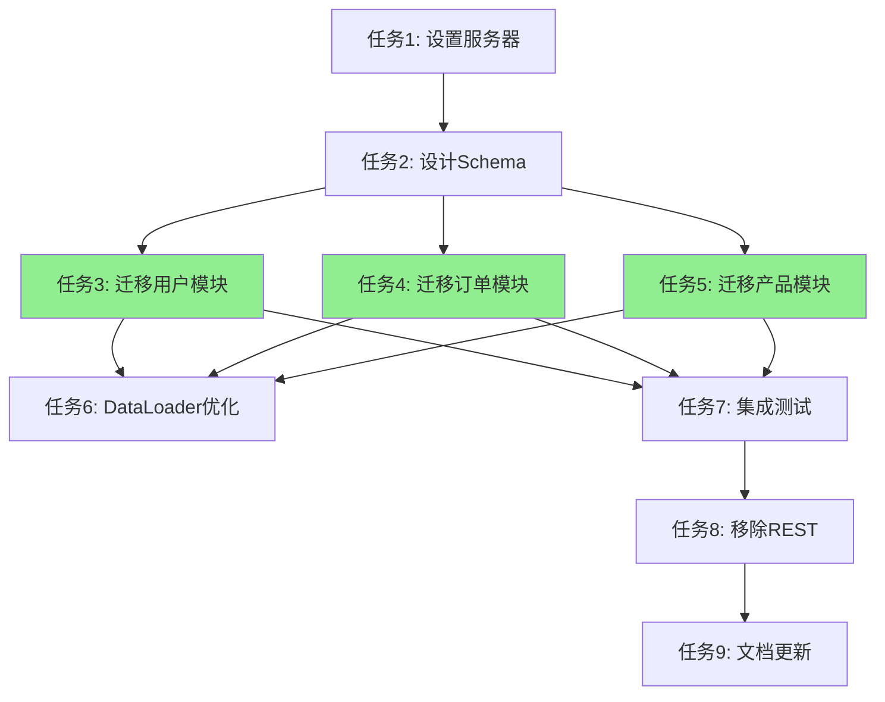

# 9. 任务分解策略

## 概述

任务分解是将复杂任务拆分为可执行单元的过程，适用于 Route C（完整流程）。

## 分解触发条件

### 何时需要任务分解

- ✅ 综合评分 ≥ 6.0（Route C）
- ✅ 涉及文件数量 > 15
- ✅ 实施周期 > 2 小时
- ✅ 存在并行执行机会

### 何时不需要任务分解

- ❌ Route A/B 级别任务
- ❌ 实施步骤简单明确

---

## 分解原则

### 1. 独立性原则

**定义**：任务之间尽量独立，减少耦合。

**示例**：
- ✅ 好：迁移用户模块 | 迁移订单模块（独立）
- ❌ 差：实现前端 + 后端（耦合）

---

### 2. 可并行性原则

**定义**：识别可并行执行的任务。

**示例**：
- ✅ 并行：迁移用户模块 || 迁移订单模块
- ❌ 串行：设置 GraphQL 服务器 → 设计 Schema

---

### 3. 优先级原则

**定义**：明确每个任务的优先级。

| 优先级 | 说明 |
|--------|------|
| P0 | 核心任务，必须完成 |
| P1 | 重要任务，应该完成 |
| P2 | 次要任务，可选完成 |

---

### 4. 粒度控制原则

**定义**：任务粒度适中，每个任务 1-4 小时。

| 粒度 | 说明 | 建议 |
|------|------|------|
| 太大 | > 4 小时 | 继续拆分 |
| 适中 | 1-4 小时 | ✅ 合适 |
| 太小 | < 1 小时 | 合并任务 |

---

## 分解步骤

### 步骤 1: 识别主要阶段

将任务分为几个主要阶段。

**示例**："REST 迁移到 GraphQL"
- 阶段 1: 设置基础设施
- 阶段 2: 迁移核心模块
- 阶段 3: 优化和测试

---

### 步骤 2: 分解每个阶段

将每个阶段分解为具体任务。

**示例**：阶段 1（设置基础设施）
- 任务 1: 设置 GraphQL 服务器
- 任务 2: 设计 GraphQL Schema
- 任务 3: 配置 Resolver 基础结构

---

### 步骤 3: 分析依赖关系

明确任务之间的依赖关系。

**示例**：
```
任务 1（设置服务器）→ 任务 2（设计 Schema）
任务 2 → 任务 3（迁移用户模块）
任务 2 → 任务 4（迁移订单模块）[可与任务 3 并行]
```

---

### 步骤 4: 分配优先级

根据重要性和依赖关系分配优先级。

**示例**：
- 任务 1（设置服务器）：P0
- 任务 2（设计 Schema）：P0
- 任务 3（迁移用户模块）：P0
- 任务 4（迁移订单模块）：P0
- 任务 5（性能优化）：P1
- 任务 6（文档更新）：P2

---

## 任务模板

```markdown
## 任务分解

### 任务 1: [任务名称]
- **优先级**：P0 / P1 / P2
- **预计时间**：[X 小时]
- **依赖**：[依赖的任务]
- **可并行**：[是/否，如果是，可以与哪些任务并行]
- **子任务**：
  - [ ] 子任务 1
  - [ ] 子任务 2
- **验收标准**：[...]

### 任务 2: [任务名称]
[...]
```

---

## 完整示例

**任务**："REST API 迁移到 GraphQL"

```markdown
## 任务分解

### 任务 1: 设置 GraphQL 服务器（P0）
- **预计时间**：2 小时
- **依赖**：无
- **可并行**：否
- **子任务**：
  - [ ] 安装 Apollo Server
  - [ ] 配置基础路由
  - [ ] 测试服务器启动
- **验收标准**：GraphQL Playground 可以访问

---

### 任务 2: 设计 GraphQL Schema（P0）
- **预计时间**：3 小时
- **依赖**：任务 1
- **可并行**：否
- **子任务**：
  - [ ] 定义 User Type
  - [ ] 定义 Order Type
  - [ ] 定义 Product Type
  - [ ] 定义 Query 和 Mutation
- **验收标准**：Schema 设计完整且符合规范

---

### 任务 3: 迁移用户模块（P0）
- **预计时间**：4 小时
- **依赖**：任务 2
- **可并行**：可以与任务 4、5 并行
- **子任务**：
  - [ ] 实现 User Resolver
  - [ ] 实现用户相关 Query
  - [ ] 实现用户相关 Mutation
  - [ ] 前端切换到 GraphQL
  - [ ] 测试用户模块
- **验收标准**：用户模块完全迁移，功能正常

---

### 任务 4: 迁移订单模块（P0）
- **预计时间**：4 小时
- **依赖**：任务 2
- **可并行**：可以与任务 3、5 并行
- **子任务**：
  - [ ] 实现 Order Resolver
  - [ ] 实现订单相关 Query
  - [ ] 实现订单相关 Mutation
  - [ ] 前端切换到 GraphQL
  - [ ] 测试订单模块
- **验收标准**：订单模块完全迁移，功能正常

---

### 任务 5: 迁移产品模块（P1）
- **预计时间**：3 小时
- **依赖**：任务 2
- **可并行**：可以与任务 3、4 并行
- **子任务**：
  - [ ] 实现 Product Resolver
  - [ ] 实现产品相关 Query
  - [ ] 前端切换到 GraphQL
  - [ ] 测试产品模块
- **验收标准**：产品模块完全迁移，功能正常

---

### 任务 6: 添加 DataLoader 优化 N+1（P1）
- **预计时间**：2 小时
- **依赖**：任务 3、4、5
- **可并行**：否
- **子任务**：
  - [ ] 分析 N+1 查询问题
  - [ ] 实现 DataLoader
  - [ ] 验证性能提升
- **验收标准**：N+1 问题解决，性能提升明显

---

### 任务 7: 集成测试（P0）
- **预计时间**：3 小时
- **依赖**：任务 3、4、5
- **可并行**：否
- **子任务**：
  - [ ] 编写端到端测试
  - [ ] 测试所有 GraphQL Query/Mutation
  - [ ] 验证与 REST 的一致性
- **验收标准**：所有测试通过

---

### 任务 8: 移除 REST API（P2）
- **预计时间**：2 小时
- **依赖**：任务 7
- **可并行**：否
- **子任务**：
  - [ ] 确认所有前端已切换
  - [ ] 移除 REST 路由
  - [ ] 移除相关代码
- **验收标准**：REST API 完全移除

---

### 任务 9: 文档更新（P2）
- **预计时间**：2 小时
- **依赖**：任务 8
- **可并行**：可以提前开始
- **子任务**：
  - [ ] 更新 API 文档
  - [ ] 更新开发者指南
  - [ ] 更新架构文档
- **验收标准**：文档完整且准确
```

---

## 并行执行图

使用 Mermaid 可视化并行执行：



绿色任务可以并行执行。

---

## 最佳实践

1. **自顶向下**：先识别主要阶段，再分解具体任务
2. **粒度适中**：每个任务 1-4 小时
3. **识别并行**：最大化并行执行效率
4. **明确依赖**：清晰标注任务依赖关系
5. **动态调整**：实施过程中发现新任务，及时补充

---

## 参考资料

- [5. Route C 完整流程](5-route-c-complete-flow.md) - Route C 中任务分解的位置
- [12. 实现计划文档](12-implementation-plan.md) - 任务分解后的实现计划
