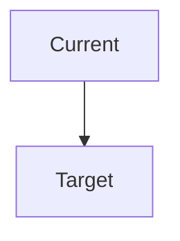
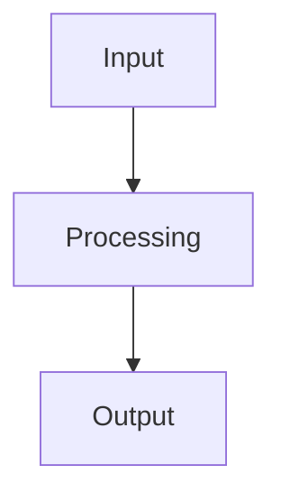

# 文档模板库

> 提供 Route B / Route C 的主文档模板。模板目标是承载阶段门禁，而不是追求冗长。

[← 上一篇: INDEX.md 结构](3-index-structure.md) | [返回知识库索引](index.md) | [下一篇: 子任务管理 →](5-sub-task-management.md)

## 模板概览

### 核心主文档

- `requirements-alignment.md`
- `design.md`
- `implementation-plan.md`
- `progress-details.md`
- `acceptance.md`
- `session-summary.md`

### 辅助文档

- `impact-analysis.md`
- `confirmation.md`
- `error-recovery.md`
- `changes-summary.md`

## requirements-alignment.md

### 用途

锁定需求、范围、约束和验收标准，并形成第一道门禁。

### 模板

```markdown
# 需求对齐

[← 返回 INDEX.md](INDEX.md)

**创建时间**: YYYY-MM-DD HH:mm

## 用户原始需求

[原始描述]

## 需求理解

- **核心目标**：[1-2 句话]
- **成功标准**：
  - [ ] 标准 1
  - [ ] 标准 2

## 范围

### 包含

- [范围内内容]

### 不包含

- [范围外内容]

## 约束条件

- [约束 1]
- [约束 2]

## Requirements Gap Scan（如适用）

- **已确认**：
  - [确认项 1]
- **可能遗漏**：
  - [遗漏点 1]
- **需要补充确认**：
  1. [问题 1]
  2. [问题 2]

## 未决问题

1. [问题 1]
2. [问题 2]

## 用户确认

- **AI 发起确认消息**：[摘要]
- **用户确认原话**：[原文]
- **确认时间**：YYYY-MM-DD HH:mm
- [ ] 用户已确认需求理解正确
- [ ] 用户已确认范围与约束
- [ ] 可以进入设计阶段
```

## design.md

### 用途

给出基于当前代码的整体技术方案，并形成第二道门禁。

### 模板

````markdown
# 技术设计

[← 返回 INDEX.md](INDEX.md)

**创建时间**: YYYY-MM-DD HH:mm

## 当前代码事实

- [现状 1]
- [现状 2]

## 方案概述

- **选定方案**：[方案名]
- **为何选择**：[原因]
- **备选方案**：[方案 B / C 及放弃原因]

## 主要改动点

- [改动点 1]
- [改动点 2]

## Requirements Gap Scan 摘要（如适用）

- [已吸收的 gap scan 结论]

## Brainstorm 总结（如适用）

### 方案 1: [名称]
- **思路**：[描述]
- **优点**：[...]
- **缺点**：[...]
- **风险**：[高/中/低]
- **成本**：[...]

### 方案 2: [名称]
...

## AI 推荐

- **建议选择**：[方案]
- **理由**：[理由]

## 用户选择 / 采纳方案

- [最终选定方案]

## Design Challenge / Completeness Review

- [检查项 1] -> [结论]
- [检查项 2] -> [结论]
- **仍待解决**：
  - [问题 1]
  - [问题 2]

## 架构图



## 流程图



## 数据流图（Route C 必填）


## 风险与回退

- [风险 1] -> [应对]
- [风险 2] -> [应对]

## 用户确认

- **AI 发起确认消息**：[摘要]
- **用户确认原话**：[原文]
- **确认时间**：YYYY-MM-DD HH:mm
- [ ] 用户已确认整体技术方案
- [ ] 可以进入实现计划阶段
````

## implementation-plan.md

### 用途

把设计拆成 TDD 驱动的步骤，并形成第三道门禁。Phase 3 起，模板还必须能承载 `Verify RED / Verify GREEN / TDD 例外`。Phase 4 起，Route C 计划还必须能表达 subagent execution overlay 的 eligibility 与 review contract。

### 模板

```markdown
# 实现计划

[← 返回 INDEX.md](INDEX.md)

**创建时间**: YYYY-MM-DD HH:mm

## 计划概览

- **目标**：[总体目标]
- **策略**：[总体策略]
- **测试策略**：[如何执行 TDD]
- **总体依赖**：[关键依赖]

## 详细步骤

### 步骤 1: [名称]

- **状态**：⏳ 待开始 / 🚧 进行中 / ✅ 已完成
- **优先级**：P0 / P1 / P2
- **依赖**：[依赖]
- **前置输入**：
  - [输入 1]
- **文件范围**：
  - [文件 1]
- **执行模式**：主会话 / subagent candidate / 强制主会话
- **Subagent Eligibility**：
  - [为何适合 / 不适合 subagent]
- **Review Contract**：spec only / spec + quality / fallback checklist
- **Failing Test**：
  - [ ] 测试 1
- **Verify RED**：
  - [ ] RED 证据 1
- **Minimal Implementation**：
  - [ ] 实现 1
- **Verify GREEN**：
  - [ ] GREEN 证据 1
- **验证命令**：
  - [ ] 命令 1
- **预期结果**：
  - [ ] 可观察结果 1
- **Refactor**：
  - [ ] 重构 1
- **Step Acceptance**：
  - [ ] 验收点 1
- **并行边界**：[可并行 / 必须串行 / 依赖说明]
- **TDD 例外**：[无 / 原因]

## 用户确认

- **AI 发起确认消息**：[摘要]
- **用户确认原话**：[原文]
- **确认时间**：YYYY-MM-DD HH:mm
- [ ] 用户已确认步骤顺序
- [ ] 用户已确认测试策略
- [ ] 用户已确认 `预期结果` 作为步骤级输出契约
- [ ] 可以进入编码阶段
```

## progress-details.md

### 用途

记录真实执行、阻塞，以及 TDD / subagent / debugging 循环。

### 模板

```markdown
# 详细进度

[← 返回 INDEX.md](INDEX.md)

**创建时间**: YYYY-MM-DD HH:mm
**最后更新**: YYYY-MM-DD HH:mm

## 当前状态

- **当前阶段**：[阶段]
- **当前步骤**：[步骤]
- **当前执行模式**：[主会话 / subagent candidate / fallback]
- **进度**：X%

## 最近完成

- ✅ [完成项]

## 正在进行

- 🚧 [进行中项]

## 执行模式

- **Subagent Eligibility**：[适合 / 不适合及原因]
- **Review Contract**：[spec only / spec + quality / fallback checklist]

## Subagent Dispatch Log

- Attempt 1: [是否 dispatch / 返回状态 / 关键信息]
- Attempt 2: [如有]

## Review Loop

- Spec Review: [通过 / 问题列表]
- Code Quality Review: [通过 / 问题列表 / fallback]

## TDD 记录

- Failing Test: [内容]
- Verify RED: [内容]
- Minimal Implementation: [内容]
- Verify GREEN: [内容]
- Refactor: [内容]

## 调试记录

- Root Cause Evidence: [内容]
- Pattern / Hypothesis: [内容]
- Verification Action: [内容]
- Fix Decision / Defense-in-Depth: [内容]

## Fallback Record

- [触发原因] -> [退回主会话 / checklist / 后续动作]

## 阻塞与处理

- [问题] -> [处理动作]
```

## acceptance.md

### 用途

把“工程验证”与“需求验收”显式分开，防止编码完成后直接收工。Phase 3 起，`acceptance.md` 还必须显式承载 fresh verification evidence。

### 模板

```markdown
# 验收记录

[← 返回 INDEX.md](INDEX.md)

**创建时间**: YYYY-MM-DD HH:mm

## 需求映射

- [ ] 需求 1 -> [验证方式]
- [ ] 需求 2 -> [验证方式]

## 验收场景

1. [场景 1] -> 通过 / 未通过
2. [场景 2] -> 通过 / 未通过

## 回归验证

- [ ] 回归项 1
- [ ] 回归项 2

## Completion Claims

- [ ] claim 1 -> [验证命令 / 证据位置]
- [ ] claim 2 -> [验证命令 / 证据位置]

## Fresh Verification Evidence

- [ ] 命令: [command]
  - 时间: [YYYY-MM-DD HH:mm]
  - 结果: [通过 / 未通过]
  - 输出摘要: [关键结论]

## Partial Verification（如适用）

- [缺口]
- [原因]

## 遗留项 / Defer

- [遗留项]

## 用户确认

- **AI 发起确认消息**：[摘要]
- **用户确认原话**：[原文]
- **确认时间**：YYYY-MM-DD HH:mm
- [ ] 用户已确认验收结果
- [ ] 可以进入收尾阶段
```

## session-summary.md

### 用途

收尾总结、记录偏差与遗留项，并承接技能治理询问。

### 模板

```markdown
# Session 总结

[← 返回 INDEX.md](INDEX.md)

**创建时间**: YYYY-MM-DD HH:mm

## 结果总结

- [结果 1]
- [结果 2]

## 关键决策

1. [决策 1]
2. [决策 2]

## 偏差与遗留项

- [偏差 / 遗留]

## 候选经验沉淀

- [候选 1]
- [候选 2]

## 治理结论

- 是否已询问：是 / 否
- 用户结论：待确认 / 不沉淀 / 更新已有 skill / 创建新 skill
```

## confirmation.md

### 用途

记录特殊决策或需要单独列出的确认项。它是辅助文档，不替代主门禁文档。

## error-recovery.md

### 用途

记录错误、排查过程和恢复动作。

## 模板使用规则

1. 新建文档时必须回链 `INDEX.md`
2. `INDEX.md` 里必须加入主文档链接
3. 主门禁状态以主文档 + `INDEX.md` 为准，不以 `confirmation.md` 为准
4. 普通“继续 / 好的 / 按这个来”不视为阶段确认，必须记录带目标阶段名的确认原话
